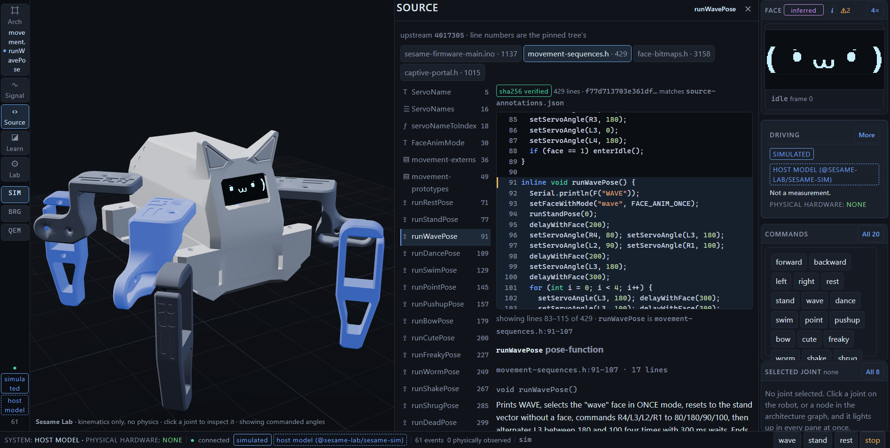
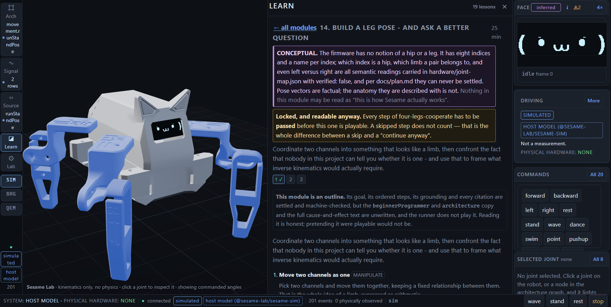

# Sesame Lab

An educational engineering platform for tracing one command all the way down — API call →
firmware function → servo angle → joint motion → OLED face — against a virtual
[Sesame](https://github.com/dorianborian/sesame-robot) quadruped robot that uses the real robot's
joint names, movement sequences, faces and API vocabulary.

It is built for a technically curious ~12-year-old, by an adult who cared a lot about not lying to
them. There is no physical robot involved, and the application says so on every screen.


## The rule this project enforces

**It refuses to claim more than it can show, and the refusal is mechanical rather than editorial.**

- **Every telemetry event carries provenance *and* an origin.** `observed` / `simulated` /
  `inferred` says what kind of claim it is; the origin says what it was observed *on*. "Observed"
  alone reads to a beginner as *observed on hardware*, so it never travels alone.
- **`isPhysicallyObserved()` is permanently false.** Nothing in this repository has ever touched a
  robot, a bare ESP32, or a logic analyser. It is a property of the design, not a gap awaiting a
  purchase (`docs/plan.md`, standing constraint), and the UI reads `PHYSICAL HARDWARE: NONE`.
- **`pwm.output` stays `INFERRED` even when real firmware is executing.** QEMU's ESP32 LEDC
  peripheral is register-accurate — all 29 duty percentages match the value the ESP32 TRM formula
  gives — but it has no timer, no clock, no GPIO connection and **produces no waveform at all**
  (`docs/findings/Q3-ledc-fidelity.md`). So the app shows the duty ratio and declines to call it a
  pulse.
- **Lessons are badged `CONCEPTUAL` when a claim cannot be traced to a pinned firmware symbol,**
  and `scripts/validate-lessons.mjs` enforces it: every factual claim must cite a symbol (44/44
  resolve), a conceptual lesson must disclose its own boundary, and a lesson **cannot promote
  itself** — its grounding must equal the value in `source-annotations.json`.
- **Unbuilt controls render a visible `NOT BUILT` panel** and structurally cannot complete a lesson
  step. 16 of 22 lesson controls and 26 of 34 check types are built; the rest fail loudly rather
  than quietly passing (`docs/plan.md`, L6).

| Real upstream firmware source, beside the joints it moves | A lesson that refuses to overstate itself |
|---|---|
|  |  |

## Quick start

Prerequisites: **Node 24+**, **pnpm** (`packageManager` pins 10.34.1), and
[`just`](https://github.com/casey/just). Developed and tested on Windows — the QEMU fetch pins a
Windows x86-64 build, and the firmware/asset scripts are PowerShell-first. The behavioural
simulator path is plain Node and has no such constraint.

```
just setup --sim # dependencies, the upstream tree and the builds - ~2 minutes
just dev-sim     # the behavioural simulator + the web UI, boots in milliseconds

just setup       # the above PLUS QEMU, the toolchain and the flash image
just dev         # real firmware in QEMU + the web UI, hot reload
just             # the menu of common recipes
```

Almost everything a clone needs is **gitignored, and therefore invisible**: `node_modules/`,
every `dist/`, `tools/`, `firmware/upstream/` and `emulator/qemu/images/`. `just setup` fetches or
builds all of it — dependencies, the workspace build, Espressif's QEMU fork (checked against their
own published SHA-256), the pinned upstream Sesame tree that the source explorer refuses to render
without, the portable Arduino/ESP32 toolchain, and the flash image `just dev` boots. Measured on a
real cold clone: **about 37 minutes and 15 GB** — of which the Arduino/ESP32 toolchain is 31
minutes and **14 GB**, all of it there to compile one 4 MB flash image. Warm it takes a couple of
seconds, because every step is detected before it runs and detected again afterwards and reports
which of the two happened. `just setup --dry-run` prints the plan and the cost without running
anything, and the plan says the 14 GB out loud before it starts.

**`just dev-sim` needs none of the emulator half**, which is what `just setup --sim` is for: it
stops before QEMU, the toolchain and the flash image, takes about two minutes, and then names the
blocking rows it deliberately left out rather than pretending the clone is complete.

There are **three** flash images with three different consumers, and only the first is built by
default: `distro-v1-esp32-cli` is what `just dev` boots, `distro-v1-esp32-nowifi` is what the
capture harness's bridge phase boots, and `distro-v1-esp32-cli-oled` is the one `just tauri-build`
bundles into the desktop app. `just setup --all-images` builds all three (about eleven minutes
more, once the toolchain is in place).

**`just doctor` is the thing to run when something is wrong.** It reads the same list `just setup`
acts on, so the two cannot disagree about what is missing: toolchain, workspace build, QEMU binary,
the three flash images, upstream checkout, Arduino toolchain, and the ports `just dev` needs. It
prints the exact command that fixes each failing row, and names which of them `just setup` would
have handled. A fresh clone is *expected* to fail several of them; the point is that it names which.

Other useful recipes (all in the `justfile`):

```
just check           # build + typecheck + 934 tests + 11 validators
just run             # one origin, no hot reload, closest to production
just qemu            # one-shot: boot real firmware, send `wave`, print the servo events
just api             # the Sesame-compatible HTTP API on 127.0.0.1:8080
just tauri-dev       # the desktop app, driving real firmware in the bundled QEMU
just verify-all      # the web target AND the packaged target, one verdict
```

`just verify-all` exists because the browser build and the packaged desktop app are two targets,
and two targets that are never verified together drift. It runs the 41-capture browser harness, the
packaged app's own resource and emulator self-tests plus the packaged-honesty phase, and the
installer check, then says **which targets actually ran**. About thirteen minutes, of which the
browser harness is twelve; `just verify-all --only packaged,installer` is the whole desktop half in
under a minute. It exits 0 only when every target ran and passed, **3 when what ran passed and
something did not run** — the usual outcome on a tree with no `just tauri-build` artefact, and
non-zero deliberately, because a green half is not a green tree.

Building the firmware yourself (`just firmware`) needs the portable Arduino toolchain from
`scripts/setup-firmware-toolchain.ps1` — `just setup` already installs it, because assembling a
flash image is a firmware compile and cannot happen without it. Regenerating the 3D assets
(`just assets`) needs the Python environment from `scripts/setup-asset-env.ps1`, which `just setup`
does **not** install; nothing required to run the app depends on it.

## Architecture

One interface, `SesameRobot` (`packages/sesame-sim/src/robot-contract.ts`), with three backends the
UI switches between at runtime:

| Backend | What it is |
|---|---|
| **SIM** | `SimulatedSesameRobot` — a host-side behaviour model over the 21 movement functions and 395 choreography steps extracted from upstream firmware. Deterministic, instant. The default. |
| **QEM** | `QemuSesameRobot` — the real Sesame firmware image executing under Espressif's QEMU fork (`esp-develop-9.2.2-20260417`), commanded over the firmware's own serial CLI on UART0. |
| **BRG** | A receive-only WebSocket feed from the Phase-0 telemetry bridge — QEMU, or a recorded replay fixture, on the other end. |

The web app (`apps/web`, React + React Three Fiber) is pure browser code. `src-tauri/` wraps it as a
desktop application; the Rust side does only what a browser cannot — supervise
`qemu-system-xtensa.exe` and read a raw TCP socket — and the carefully-fuzzed TypeScript protocol
parser is not reimplemented (`docs/plans/phase-5-tauri-desktop-app.md`).

Two facts about the emulator that are easy to trip over:

- **The emulated board is the legacy Distro V1 (original ESP32), not the S2 Mini the build guide
  recommends.** Espressif's QEMU offers `esp32` and `esp32s3` machines and **no `esp32s2` machine at
  all** (`docs/findings/Q1-qemu-spike.md`). Renode does not have an ESP32 platform of any kind — it
  executes real Xtensa compiler output correctly but dies on instruction #0 of a real image, and was
  costed at 16–25 engineering days to reach `setup()` before being superseded
  (`docs/findings/GATE-A-renode-boot.md`).
- **Roughly 28% of QEMU boots panic with a cache error and emit nothing** — ISSUE-20260823-022, a
  gap in QEMU's ESP32 cache/DPORT model, measured at 30 failures in 107 boots. Connecting retries
  past it: 0 failures in 25 connects (`docs/findings/Q2-qemu-backend.md`). `just qemu-flake`
  re-measures it.

## What this deliberately does not do

- **It will never run on physical hardware.** No robot, no bare board, no logic analyser — a
  standing project constraint, not a backlog item. Values only hardware could settle (semantic
  left/right joint identity, horn spline offset, mechanical travel limits, real servo slew) stay
  permanently marked unverified, and the type system will not let a guess be written as a fact.
- **No physics.** Kinematics only — no gravity, no contact, no collision. The status line says so.
- **No Wi-Fi emulation.** The QEMU image has Wi-Fi elided; the HTTP surface is reproduced by a host
  proxy that replicates the firmware's quirks rather than its radio.
- **No LEDC waveform**, per Q3 above. The instrumented-firmware telemetry hook is therefore
  permanently load-bearing rather than a stopgap.

## A note on the findings

The `docs/findings/` tree is unusually candid, on purpose. This project repeatedly discovered that
its own assertions were hollow, and the record says so rather than tidying it away: a
`querySelector !== null` check that passed happily for a hidden button; an "it scrolled there"
assertion that had gone vacuous; an unfold branch whose "is there room?" measurement was 0 by construction, so it could
never fire; a
`git apply` that printed `Skipped patch` and exited 0, so three firmware profiles silently compiled
the same board; telemetry that was perfectly correct and perfectly undelivered, emitted to USB-CDC
where nothing was listening.

None of those was caught by the check that owned it. Each was caught by a *different* artifact or a
*different* agent (`docs/findings/PHASE-0-SUMMARY.md` §5). The rules that came out of it — never
accept a tool's own success signal as evidence it did the thing; verify against an artifact someone
else derived from the same ground truth; a check that has never failed is not known to work — are
now enforced in code rather than in prose.

## Upstream

This project exists because **[the Sesame Robot Project](https://github.com/dorianborian/sesame-robot)
is open source.** Sesame is an ESP32-based 3D-printed quadruped with published firmware, CAD, STLs
and build documentation, licensed Apache-2.0. Every joint name, movement sequence, face and API
route here comes from that work, pinned at commit `4017305`.

Upstream source is **not** vendored into this repository; it is fetched at build time into
`firmware/upstream/` (gitignored) and never modified — this project's firmware changes live as
patch files in `firmware/patches/`. Sesame Lab is not endorsed by or affiliated with the Sesame
Robot Project.

## Licensing

Sesame Lab is licensed under the **Apache License 2.0** — see [`LICENSE`](LICENSE).

Three things are worth knowing before redistributing anything:

- Material derived from upstream Sesame (face artwork, extracted choreography, provenance citations,
  derived geometry) is Apache-2.0 and attributed in [`NOTICE`](NOTICE), which also carries the
  Apache-2.0 §4(b) notice of modification.
- **The desktop installer bundles QEMU, which is GPL-2.0**, and that carries real obligations for
  whoever ships the installer.
- **The QEMU-bootable flash image statically links LGPL-2.1-or-later code** (the arduino-esp32
  Arduino core layer and ESP32Servo), alongside BSD and MIT libraries.

[`THIRD-PARTY-NOTICES.md`](THIRD-PARTY-NOTICES.md) has the full text and obligations; the reasoning
behind them is in `docs/findings/LICENSE-AUDIT.md`, and the ordered release steps are in
`docs/findings/PUBLIC-RELEASE-CHECKLIST.md`. None of it is legal advice.

## Where the evidence lives

`docs/` is the manual, and `docs/index.yaml` is its table of contents.

| | |
|---|---|
| `docs/plan.md` | Phases, the standing no-hardware constraint, every decision and every error, dated |
| `docs/findings/` | 48 evidence documents. Every claim is tagged `[RAN]` (verified by running), `[SRC]` (read from a file here), or `[INFER]` (reasoned, not observed) |
| `docs/decisions/` | ADRs — behavioural-simulator-first, and the Renode sidecar |
| `docs/plans/` | The executed plan for each phase |
| `docs/issues.yaml` | The issue register, including ISSUE-20260823-022 above |
| `docs/protocol/` | The `@SESAME` telemetry wire contract |

Good places to start: `docs/findings/PHASE-0-SUMMARY.md` (an independent audit written by an agent
that did none of the work, including 20 corrections to the research report and 16 defects found in
upstream), `docs/findings/Q1-qemu-spike.md` (real firmware reaching `setup()`), and
`docs/findings/Q3-ledc-fidelity.md` (why one row in the UI will not say `observed`).
