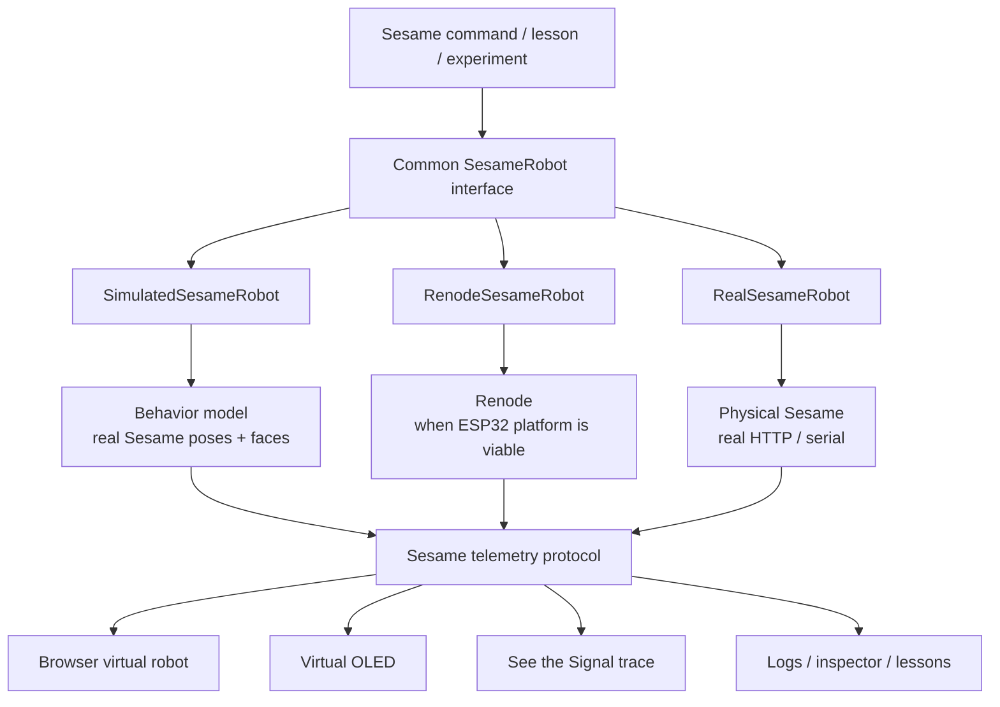

# ADR-0001 — Behavioral-simulator-first, Renode-ready

- **Status:** Accepted
- **Date:** 2026-08-23
- **Deciders:** Sesame Robot Emulator Phase-0 team
- **Source:** `research/Sesame Lab_ Emulator, Virtual Robot, and Interactive Engineering Learning Platform.md`, section *Executive findings and architecture decision*

---

## Context

Sesame Robot Emulator's end state is a continuum from physical hardware, through firmware
emulation and visualization, to guided learning and experimentation. The obvious
naive architecture is to make firmware emulation the foundation: run the real
compiled Sesame firmware under an emulator, and let everything else (visualizer,
lessons, telemetry) hang off that.

The research report's central empirical finding argues against that ordering:

> **Sesame is simpler at the application layer, and harder at the SoC-emulation
> layer, than the high-level project description initially suggests.**

Two concrete observations drive this:

1. **The application layer is shallow.** Sesame's movement system is not a
   gait-planner or an IK stack. It is explicit sequences of servo-angle commands
   and delays — `runStandPose()` and `runWavePose()` call `setServoAngle()`
   directly for named joints, with a canonical wire/action order of
   `[R1, R2, L1, L2, R4, R3, L3, L4]`. A host-side behavioral simulator can
   therefore reproduce the *real* movement semantics without executing a single
   Xtensa instruction.

2. **The SoC layer is a research problem, not an engineering task.** Renode
   supports the Xtensa architecture and 1.16.1 added an ESP32 UART model, but the
   official supported-board catalog contains no ESP32 entry, and an open Renode
   issue continues to distinguish "Xtensa translation support" from a usable,
   complete ESP32 platform. The report's defensible conclusion as of
   2026-08-23 is that **there is no demonstrated official Renode platform on
   which the unmodified current ESP32-S2 or ESP32-S3 Sesame firmware can simply
   be loaded and expected to boot.**

Building the learning platform on top of an unsolved SoC-modeling problem would
couple every user-visible feature to the highest-risk unknown in the programme.

## Decision

**Adopt a behavioral-simulator-first, Renode-ready architecture.**

All robot backends sit behind one common `SesameRobot` interface:

The load-bearing principle, in the report's words:

> **Renode becomes one interchangeable robot backend rather than the foundation
> on which every other feature depends.**

Concretely:

- `SimulatedSesameRobot` (behavioral) is the **MVP** backend. It replays Sesame's
  real pose sequences, face assets, and timing, extracted from pinned upstream
  source — not re-invented.
- `RenodeSesameRobot` is a **research track** backend, developed in parallel and
  gated on its own feasibility spike (Phase-0 workstream R, Gate A).
- `RealSesameRobot` targets physical hardware over the existing HTTP/serial
  contract, at the adapter layer.
- All three emit the **same canonical telemetry protocol**. The frontend, the
  virtual OLED, the "See the Signal" trace view, and the lessons are written
  against that protocol and are therefore backend-agnostic.
- Physics is explicitly **not** required for the first version; the system
  evolves toward a digital twin incrementally rather than targeting one now.

### Decision table cited from the report

| Decision | Recommendation | Confidence |
|---|---|---:|
| Build a useful virtual Sesame now | **Yes** | Very high |
| Build it in the browser | **Yes** | High |
| Use the real movement/face semantics | **Yes** | Very high |
| Require physics for the first version | **No** | Very high |
| Reproduce the real Sesame REST contract | **Yes, at the adapter layer** | High |
| Treat Renode as the initial backend | **No** | High |
| Run a focused Renode feasibility spike | **Yes, immediately and in parallel** | Very high |
| Assume unmodified S2/S3 Sesame boots in Renode | **No** | Very high |
| Extend Sesame Studio as the primary UI | **No; reuse concepts/data, not its Tkinter UI** | High |
| Reuse the existing Sesame Simulator | **Only after license/build/API gates pass** | High |
| Use one interface for physical/simulated/emulated robots | **Yes** | Very high |
| Target a "digital twin" immediately | **No; evolve toward one incrementally** | Very high |

The report's terminology ladder, which this ADR adopts as project vocabulary:

| Term | What it means for Sesame | First-release priority |
|---|---|---:|
| **Firmware emulator** | Compiled Sesame Xtensa firmware executes against emulated ESP32 peripherals | Research track |
| **Behavioral simulator** | Host code reproduces Sesame commands, faces, timing, joint outputs without executing ESP32 instructions | **MVP** |
| **Visualization** | 2D/3D Sesame follows commanded joints and OLED state | **MVP** |
| **Physics simulator** | Mass, gravity, contact, servo dynamics, collisions determine body motion | Later |
| **Digital twin** | Common model combines firmware state, hardware state, interfaces, physical behavior | Long-term |

## Consequences

### Positive

- The educational application and the virtual robot are **decoupled from the
  highest-risk research problem**. A negative Renode result costs us a backend,
  not the product.
- The Renode spike can run **fully in parallel** from day one (Phase-0 workstream
  R), and a precisely characterised negative result is a successful deliverable.
- Swapping in `RenodeSesameRobot` later requires, in the report's phrasing,
  *zero architecture change* — the telemetry protocol is the seam.
- Fidelity becomes machine-readable rather than a UI convention: telemetry events
  carry an `observed | simulated | inferred` provenance tag, so a lesson can
  honestly tell a learner whether it is showing a measured or a modelled value.

### Negative / costs

- The behavioral model must be **derived from pinned upstream source**, not from
  prose, or it silently diverges from the real robot. This forces the boundary
  inventory (F4) and the pinned upstream checkout (F2) to be real work, done
  with `file:line` provenance.
- Two backends means two paths to keep honest. The mitigation is a contract test:
  identical telemetry through the simulated path and the emulated/replay path
  must produce identical output.
- Some phenomena — boot behavior, peripheral-level timing, the hard-fail-on-OLED
  boot path — are simply invisible to a behavioral simulator. Lessons that need
  them depend on the research track landing.

### Neutral

- Renode work is not cancelled, deprioritised, or hidden. It is re-scoped from
  *foundation* to *one interchangeable backend*, and it retains a dedicated
  Phase-0 workstream with its own gate.

## Related

- ADR-0002 — Renode portable sidecar (how the Renode research track is installed)
- `docs/plans/phase-0-foundations-and-renode-research.md` — the execution plan
