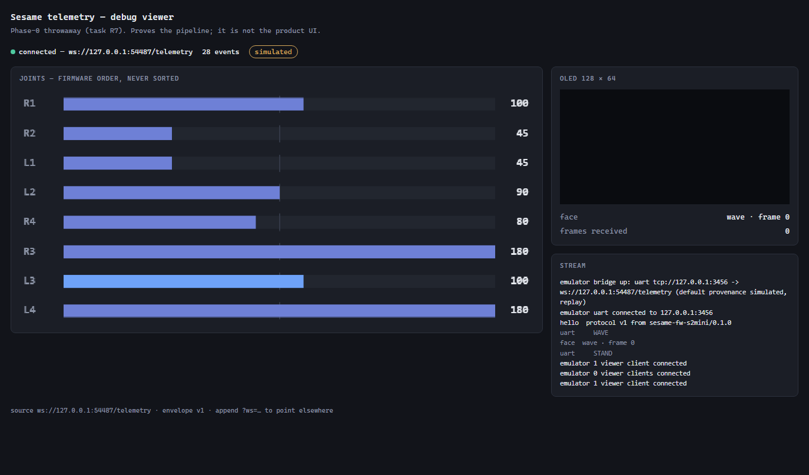
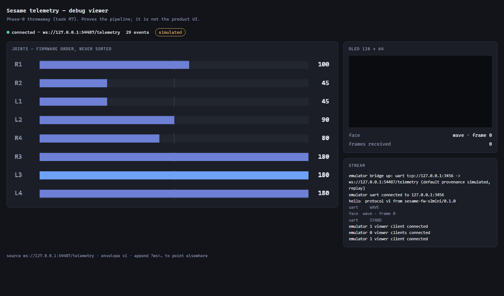

# Sesame Lab — Phase 0 summary

**Phase:** Foundations (F1–F6) + Renode research (R1–R7)
**Author:** `gate-reporter` — independent synthesis. This agent performed none of the Phase-0 work.
It read every findings document, re-ran what could be re-run, audited claims against the evidence
they cite, and records disagreements rather than smoothing them.
**Date:** 2026-08-23 · **HEAD at time of writing:** `be9e56e` (9 Phase-0 commits)
**Plan:** `docs/plans/phase-0-foundations-and-renode-research.md`
**Report under test:** `research/Sesame Lab_ Emulator, Virtual Robot, and Interactive Engineering Learning Platform.md`

**Companion gate reports:** [`GATE-A-renode-boot.md`](GATE-A-renode-boot.md) ·
[`GATE-B-servo-extraction.md`](GATE-B-servo-extraction.md)
**Closeout:** §10, appended by `phase0-closeout` · [`EXP6-oled.md`](EXP6-oled.md)

---

## 0. The phase in five sentences

Phase 0 asked whether the research report's architecture survives contact with the machine. It
does, and the report's central call — behavioural simulator first, Renode as a swappable backend —
is now **evidence-backed rather than merely prudent**. The CPU underneath Renode turned out to be
far better than the report feared; the SoC above it turned out to be entirely absent, and is now
priced at ≈16–25 engineering days to reach user code with no Wi-Fi story at any price. The servo
signal, the joint semantics, the movement corpus, the telemetry protocol and a working bridge all
exist and are consumable by Phase 1 today. Three defects in our own work were caught only because
a *different* artifact or a *different* agent checked them — which is the most transferable result
of the phase.

Evidence classes used throughout: **`[RAN]`** verified by running · **`[SRC]`** read from a file
on this machine or an upstream repository · **`[INFER]`** reasoned, not observed · **`[GR]`**
re-verified independently by this agent.

---

## 1. Every experiment from the report's table

The report proposed ten decision-producing experiments. The plan put **1–7** in scope; experiment
**8** was reached opportunistically via R7. Experiments **9 and 10 were explicitly out of scope**
and were **not run** — see §1.2.

### 1.1 Experiments 1–8

| # | Experiment | Report's pass criterion | Result | Evidence |
|---|---|---|---|---|
| **1** | **Firmware build** | clean deterministic build | **PASS** — and stronger than asked. Four profiles (`s2mini`, `distro-v3-s3`, `distro-v1-esp32`, `s2mini-instrumented`) build clean and **bit-for-bit reproducible** across full `--clean` rebuilds. Nothing installed machine-wide (two separate leaks found and closed) | F3 §6–§7 `[RAN]`. `[GR]` s2mini ELF re-hashed this session: `5436d303…9eedfd`, matches `reproducibility.json` |
| **2** | **Minimal Xtensa** | reaches breakpoint / known code | **PASS** — real `xtensa-esp32s2-elf-gcc 14.2.0` output executes on `cpuType: "esp32s2"`. Five-rung ladder: windowed ABI, all six window overflow/underflow handlers (26/26, 78/78, 35/35 vector entries, 0 escapes), `memw`, 41/43 special registers, 49/54 opcode probes | R1 §5.2, R2 §3 `[RAN]` |
| **3** | **Minimal UART** | exact message observed | **PASS** — freestanding C on the emulated core wrote UART0 MMIO; 199 bytes arrived byte-identical on a host TCP socket and decoded through the real R5 parser to `{type:'servo.target', joint:'R4', angleDeg:72, provenance:'observed'}` | R3 §5 `[RAN]` |
| **4** | **Arduino startup** | marker appears | **FAIL** — none of the four raw UART markers ever reached the socket. The minimal sketch aborts on **instruction #0** (`entry a1,48` at `0x40025504`, `PS.WOE=0`, no boot ROM). Fallback per the report: *"inventory SoC startup dependencies"* — done, §9.1 of R4 | R4 §2 `[RAN]` |
| **5** | **Sesame early boot** | identify exact first failing block | **The experiment PASSED; the boot did not.** The pass criterion is identification, and it was met precisely: first blocker `entry` at `0x40025738`; then, in order, ROM (`0x4000FF58`), EXTMEM cache (`0x400184BE`), `saltu` at `0x400E6AD2` in `s_get_bus_mask` (`cache_ll.h:473`), `rer` at `0x4009BAC2` in `panic_handler`. **0 of 20 `bootOrder` steps reached; 34 ESP-IDF startup functions short of `setup()`** | R4 §4 `[RAN]` |
| **6** | **OLED** | `display.begin()` succeeds, pixels observable | **FAIL against the literal criterion, split three ways** — see [`EXP6-oled.md`](EXP6-oled.md), written by `phase0-closeout`. **Renode: NO** — `display.begin()` is `bootOrder` step 4 of 20 and 0 steps are reached; making it runnable costs ≈21–33 d (≈16–25 d to `setup()`, +3–5 d I²C, +2–3 d SSD1306). **Instrumentation: YES** — the compile-gated OLED framebuffer hook was built for the first time (`s2mini-oled`, one `-D`), and it compiles, links, keeps its symbols, reads the real `Adafruit_SSD1306` buffer, routes to `Serial0`, and round-trips into a typed 128×64 `oled.frame`. **Silicon: untested.** *The plan's own gap — no task ever owned this experiment — is now closed with a recorded result* | R1 §6, R4 §9.2 items 18–19; EXP6 §2–§4 `[RAN]` |
| **7** | **Servo** | joint + angle event captured | **PASS** via instrumented firmware. Single convergence point verified independently; 223/223 servo steps covered; reproducible ELF; format verified at source, patch, binary and call-site level | R6 §2–§4; Gate B §2 `[GR]` |
| **8** | **Browser joint** | correct joint visibly moves | **PARTIAL PASS.** The architecture is proven end to end — Path B (replay → socket → bridge → WebSocket → canvas) and Path A (**real Renode** → emulated UART → same bridge) produce byte-identical envelope sequences, with an automated e2e test asserting all 35 fixture lines, gapless `seq`, and the L3 wave being exactly `180,100,180,100,…`. **But the report's experiment says "a real Sesame mesh" and R7 ships eight labelled canvas bars.** No mesh, no R3F, no 3D transform — deliberately, as a throwaway harness. **The browser hop is now evidenced too:** `phase0-closeout` drove headless Edge over CDP against the live bridge and captured two renders at different points in the wave, with the joint angles read back out of the rendered canvas (§10) | R6/R7 §6–§9 `[RAN]`; `[GR]` 60 bridge tests pass; `docs/findings/assets/exp8-browser-*.png` `[RAN]` |

### 1.2 Experiments 9 and 10 — out of scope, not run

Stated plainly rather than omitted:

- **Experiment 9 — existing-sim reuse (Gate C).** *Is `one-for-all/sesame-robot-sim` reusable?*
  **Not attempted.** The plan's non-goals exclude the reuse audit explicitly. Nothing in Phase 0
  cloned, built or license-audited that repository, and nothing here should be read as evidence
  about it. The report's own concern — local path dependencies and no surfaced root license — is
  untested. Same for the report's suggestion of **Sesame ML** (Apache-2.0, URDF/MJCF/meshes) as an
  asset source: not evaluated.
- **Experiment 10 — real/virtual parity.** *Does one command use an identical contract against
  physical and virtual backends?* **Not attempted, and not attemptable** — there is no physical
  backend, no virtual backend, and no board. Phase 0 produced the *ingredients* (the joint map,
  the movement corpus, the protocol, the route inventory) but ran no parity test.

---

## 2. Every gate

| Gate | Question | Answer | Basis |
|---|---|---|---|
| **A** | Can Renode execute a target S2/S3 Arduino binary far enough to reach user code? | **Layered. Below the CPU line YES (high confidence); above the CPU line NO.** Overall verdict: **NO**, with a sized, ordered, priced backlog: ≈16–25 d to `setup()`, +10–16 d for a robot that moves, Wi-Fi not costable | [`GATE-A-renode-boot.md`](GATE-A-renode-boot.md) |
| **B** | Can a servo target be captured deterministically? | **YES — via instrumented firmware.** Verified at source, patch, binary, disassembly and transport level. The emulated-peripheral (LEDC) route is untouched and gated behind Gate A's backlog. **Never run on silicon** | [`GATE-B-servo-extraction.md`](GATE-B-servo-extraction.md) |
| **D** | Can the virtual backend expose `/api/status` and `/api/command` semantics? | **YES — reasoned from evidence, not implemented.** See §2.1 | F4 §1.9, §1.12, §2.2; `hardware-map.json → network.routes` |
| **C** | Can `one-for-all/sesame-robot-sim` be legally and reproducibly reused? | **OUT OF SCOPE — unanswered.** No clone, no build, no license audit | plan §1 non-goals |
| **E** | Does any near-term lesson require gravity/contact? | **OUT OF SCOPE — unanswered.** No lesson content exists, so the question has no subject yet | plan §1 non-goals |
| **F** | Can every lesson pointing at "how Sesame actually works" cite a pinned firmware symbol/source location? | **OUT OF SCOPE as a gate — but Phase 0 built the machinery to pass it.** `hardware-map.json` carries **1167 provenance citations with line numbers verified against the pinned tree** `[GR]`, the upstream commit is pinned at `401730514cefed738710d22303e84b0dcd6b76d0` with 129/129 files byte-identical to the vendored reference, and `joint-map.json` enforces a three-class epistemic contract in schema, validator and TypeScript types | F2, F4, F6 |

### 2.1 Gate D reasoning — API parity

The report's position was *"almost certainly yes at a host proxy irrespective of Renode Wi-Fi,
because these are application-level contracts."* Phase 0 did not implement it, but produced
enough evidence to answer confidently.

**Answer: YES, at a host proxy, ~4–6 engineering days, provided five documented quirks are
replicated.** Supporting evidence:

- The complete surface is captured with `file:line` provenance and handler symbols: **10 HTTP
  routes** (9 explicit + `onNotFound`), 21 commands, `/getSettings`' exact 4 keys, the AP/station
  flags, and the DNS/mDNS setup. Nothing about the contract has to be rediscovered.
- Nothing in the contract depends on the radio. `/api/command` parses its body by hand with
  `indexOf`/`substring` — no JSON library — so a host proxy can reproduce it exactly, including
  its tolerances.

The five quirks that make naive parity wrong:

1. **All ten routes are registered `HTTP_ANY`** (the 2-arg `WebServer::on()` overload). A proxy
   that enforces GET/POST is *stricter than the robot*. Only `/api/command` and
   `/api/wifi/connect` check the method in-handler and return 405.
2. **Three routes the report omits** — `/api/wifi/scan`, `/api/wifi/connect`, `/api/wifi/status` —
   plus the catch-all.
3. **`/api/status` can report a face that is not on the screen.** Requesting `default`, `stand` or
   any unknown name sets `currentFaceName` while leaving the previous frame displayed (§4.1).
4. **The settings round-trip is asymmetric.** The captive portal sends and reads `motorSpeed`,
   which neither handler touches; it never sends `faceFps`, which the API does support. A
   faithful proxy must reproduce an inert control.
5. **`192.168.4.1` is an Arduino-ESP32 SoftAP default read at runtime** (`WiFi.softAPIP()`), not a
   firmware constant. A virtual backend is free to hand back something else — and should say so.

Not verified: no request has ever been served by anything, real or virtual. Gate D is a
well-founded prediction, not a measurement.

---

## 3. Corrections to the research report

The plan is explicit: *where this machine's evidence disagrees with the report, the evidence wins
and the disagreement is recorded.* **Twenty corrections**, grouped. Confirmations are included
where the report made a checkable claim that held, because a corrections list that only lists
failures gives no sense of the report's overall accuracy — and it was accurate far more often than
not.

### 3.1 Renode and the SoC

| # | The report said | We measured | Evidence |
|---|---|---|---|
| 1 | "Renode's supported-board documentation has no ESP32 match… no official ESP32 platform" | **CONFIRMED, emphatically.** Zero files matching `*esp*` in the 893-file 1.16.1 distribution **and** in the 1.15.3 system install. The entire ESP32 surface across both upstream repos is **one file**, `ESP32_UART.cs`, and nothing is in flight | R1 §3–§4 `[FILE]` `[SRC]`; `[GR]` re-run: 0 esp files in both installs, 3 xtensa files |
| 2 | "Renode 1.16.1, released February 2026, added an ESP32 UART peripheral model" | **Right on substance, wrong on the version.** The model shipped in **1.16.0** (2025-08-03); the 1.16.1 notes contain no ESP32 item. It is present in 1.16.1 and does work. (The 1.16.1 Xtensa assembler/disassembler claim *is* correct) | R1 §2 rows 1–2 `[SRC]` GitHub release bodies |
| 3 | Implied that register windows / Xtensa completeness were the likely killer — the thing that would have made the approach unaffordable | **Not the killer.** The windowed ABI and **all six** register-window overflow/underflow handlers work completely, proven by counting vector entries in a full PC trace (26/26, 78/78, 35/35) with zero escapes to the user, kernel or double-exception vector | R2 §3.2–§3.3 `[RAN]` |
| 4 | Treated Xtensa cache control and conditional store as open risk rows | **Non-questions for this target.** `xtensa-esp32s2-elf-as` *rejects* `s32c1i`, `SCOMPARE1`, `ATOMCTL` and every cache instruction for the S2 core config, and the real 135,118-instruction image contains **zero** cache instructions — the S2's cache is outside the core, driven over MMIO. Two feared categories removed before emulation was involved | R2 §1.2 `[RAN]` |
| 5 | Feasibility row: "ESP32 UART — direct model exists; S2/S3 compatibility must be tested" | **Tested; the answer is "partly".** 11 of 30 enumerated registers implemented. `UART_INT_ST` (0x08) never exposed, so nothing interrupt-driven works. And the layout is **S3/C3-shaped, not S2**: the S2 has no `CLK_CONF`; `0x74` is `UART_DATE` and `0x78` is `UART_ID`, which the model decodes as `CLK_CONF`. Polled TX works perfectly — which is exactly enough for the telemetry line protocol | R1 §5.3, R3 §4 `[RAN]` `[SRC]` |
| 6 | "Interrupt controller — needs source audit/modeling · **boot blocker**" | **Splits in two.** CPU interrupt *delivery* already works with no controller model (`IRQ -> cpu@N` in a `.repl` drives `TlibSetIrqPendingBit`). The ESP32 interrupt *matrix* is absent and must be modelled (3–5 d) | R1 §9, R4 §9.2 item 12 |
| 7 | "Timers/system clocks — needs source audit/modeling · boot/runtime blocker" | **Splits.** The Xtensa CCOMPARE0–2 internal timers are already modelled and all three read/write correctly. Only the compare→interrupt map and the ESP32 TIMG/systimer peripherals are missing | R1 §9, R2 §3.4 |
| 8 | Implicitly, that Xtensa translation support might not reach ESP32 cores | **Refuted, and it is not new.** `esp32`/`esp32s2`/`esp32s3` core configs are present in **1.15.3** too — ESP32 core support is old news that nobody ever wired to a platform | R1 §3 `[RAN]` |
| 9 | "Missing S2/S3 peripheral work: **weeks to months**"; "full SoC fidelity: potentially multi-month" | **Bounded.** Reaching user `setup()` is **≈16–25 engineering days** by R4's own line items (R4 headlines a padded ≈18–30 d — see Gate A §4.2), across eleven items each anchored to an observed PC or a counted static reference. Add **+10–16 d** for a robot that moves. **Wi-Fi remains uncosted and should stay that way** | R4 §9 `[RAN]` `[INFER]`; arithmetic re-checked `[GR]` |
| 10 | (unanticipated) | **Renode is *more permissive* than the silicon.** A deliberately unaligned 16-bit load raised no exception; real S2 hardware raises `LoadStoreAlignmentCause`. A firmware alignment bug would go unnoticed under emulation. Teaching-fidelity caveat, not a blocker | R2 §3.5 `[RAN]` |
| 11 | (unanticipated) | **`rer` hard-aborts the emulator** rather than raising an exception — and it lives in `panic_handler`. The first fault the real boot takes kills Renode within ~15 instructions, destroying every diagnostic you would want at that moment. Upgraded from "cheap nice-to-have" to **prerequisite for all further debugging** (0.5 d) | R2 §3.6, R4 §4.6 `[RAN]` |
| 12 | (unanticipated) | **`salt`/`saltu` are missing from all three ESP32 core configs, and the root cause is a wrong `#include`.** tlib's `arch/xtensa/core-esp32s2.c` pulls in `core-esp32/xtensa-modules.c.inc` — the **LX6** table — for both LX7 cores. `translate_salt` already exists. The fix is dropping in Espressif's generated LX7 table from `espressif/qemu`. Re-costed from R2's 1–2 d to **~1 d**, gated behind a 1–2 d one-off tlib/Renode build bring-up | R2 §4, R4 §7.1 `[SRC]` |
| 13 | R1/R2 (not the report): the hardcoded CCOMPARE map `{6,10,13}` "**BLOCKS the FreeRTOS tick**" | **Downgraded.** S2's `XCHAL_TIMER0_INTERRUPT` is 6 and this build uses `CONFIG_FREERTOS_CORETIMER_0` with `SYSTICK_USES_CCOUNT`, so Renode's `intMap[0]` is **correct**. Only CCOMPARE1/2 are wrong and neither is used here. 0.5 d correctness fix, not a boot blocker | R4 §6.2 `[SRC]` |

### 3.2 The Sesame firmware as the report describes it

| # | The report said | We measured | Evidence |
|---|---|---|---|
| 14 | Boot order: "serial → I²C → SSD1306 (hard fail) → Wi-Fi → server → servo timers → attach" | **Correct as far as it goes, but six of twenty steps are missing**: `randomSeed(micros())` (`:653`), the OLED splash render — the first visible frame (`:664-669`), `WiFi.persistent(false)` (`:674`), mDNS start / scroll-text build (`:695-700`), input-tracking init (`:703-705`), and — the notable one — **`dnsServer.start(53, "*", myIP)` at `:709`, *before* route registration**. A boot probe watching for "server up" must expect UDP/53 first | F4 §2.1 `[SRC]`; `hardware-map.json → bootOrder` (20 steps) |
| 15 | "per-face frame rates/modes such as loop, once, and boomerang" | **Rates are per-face; modes are not.** `currentFaceMode` is a **single global**, overwritten at each `setFaceWithMode()` call site. `setFace()` alone leaves it untouched, so `POST /api/command {"face":"happy"}` inherits whatever the previous animation left behind. **19 of the 38 registered faces are never passed to `setFaceWithMode()` anywhere** and have no intrinsic mode at all. A simulator that stores `mode` on the face record will render differently from the robot | F4 §2.3 `[SRC]` |
| 16 | Six HTTP routes, labelled GET/POST | **Nine explicit registrations plus a catch-all, and all ten are `HTTP_ANY`** (the 2-arg `on()` overload). Missing from the report: the three `/api/wifi/*` routes and `onNotFound` | F4 §2.2 `[SRC]` |
| 17 | `setServoAngle()` ends in "a configurable delay intended to reduce power-current surges" | **Accurate as intent, incomplete as behaviour.** The call is `delayWithFace(motorCurrentDelay)`, which spins on `updateAnimatedFace()` + `server.handleClient()` + `dnsServer.processNextRequest()`. **Every servo write is a re-entrancy point**: an HTTP request can be accepted mid-pose, and a face animation can advance. A model treating it as dead time will mis-order events against the telemetry stream | F4 §2.4 `[SRC]` |
| 18 | Sesame Studio presents "colour-coded S0–S7 controls" | **Studio's widgets are keyed and labelled `R1`…`L4`**, the firmware names. It also enforces per-joint input ranges the firmware does not (45–180, 0–135, 0–180 by joint, versus a flat 0–180 clamp). Relevant to Phase-1 pose-editor parity: Studio's ranges are a *convention*, not a firmware limit | F4 §2.5 `[SRC]` |
| 19 | The AP address `192.168.4.1` | **Not a firmware constant** — read at runtime from `WiFi.softAPIP()` and interpolated. Correct in practice, but it is an Arduino-ESP32 default, so a Wi-Fi mock may legitimately return something else. Recorded as `defaultIpVerified: false` | F4 §2.6 `[SRC]` |
| 20 | Experiment 8: "move a **real Sesame mesh**… R3F transform" | **Delivered as eight labelled canvas bars plus a 128×64 pixel grid**, not a mesh. Deliberate — R7 was a declared scope stretch with a throwaway viewer — but the experiment as written is only partially satisfied | R6/R7 §5.5 |

### 3.3 Corrections to our own findings documents

Recorded here rather than by editing another agent's file, per the phase's separation rule.

| Document | Claim | Correction |
|---|---|---|
| R4 §9.1 | "Subtotal ≈16–27 d → realistic band ≈18–30 d" | Line items for 1 and 3–11 sum to **15.25–23.25 d**; with the 1–2 d bring-up, **≈16–25 d**. The headline is padded in the prudent direction, which is fine, but it should be labelled as padding rather than presented as a sum `[GR]`. **CORRECTED IN PLACE** by `phase0-closeout` at all four occurrences in R4, each carrying a dated correction note |
| R2 §5 | "96.5 % of the real firmware's instruction stream" | True **by occurrence**, and an upper bound (the 188-mnemonic probe set is disassembled, not executed). By **distinct mnemonic** the coverage is 169/205 = **82.4 %** `[GR]`. **CORRECTED IN PLACE** — R2 §5 now states both figures side by side and labels which is which |
| R6/R7 §1 | "All **21** movement functions … route through it" | 223/223 servo steps do route through the single hook — verified independently. But **19 of 21** functions contain servo steps; `enterIdle` and `exitIdle` contain none `[GR]`. **CORRECTED IN PLACE**; the Gate-B conclusion is unaffected. Re-derived a third time by `phase0-closeout` `[RAN]` |
| R6/R7 §11 | Patch is "4 hunks, +126/-0" | Stale, from the pre-fix version. §2 of the same document says 196 added / 0 removed, which is correct: `[GR]` the file has 4 hunks, 196 added lines, 0 removed. **CORRECTED IN PLACE** |
| `hardware/hardware-map.json` | `meta.sourceTree.upstreamCommit: null`, noted "Unknown at F4 time — F2 owns resolving it" | **F2 resolved it** (`401730514cefed738710d22303e84b0dcd6b76d0`) and the map was committed in the same wave. The field was still null, so the single most provenance-heavy artifact in the repo did not name the commit its 1167 citations point into. **FIXED by `phase0-closeout`** — the commit is recorded, the stale note replaced, and `validate-hardware-map.mjs` now cross-asserts it against `firmware/upstream.pin.json` (negative case exercised). §10 |
| `hardware/assets-inventory.json` | `meta.sourceTree: "reference/sesame-robot-main/hardware/printing/stl"` | F5 measured from the **vendored reference copy**, not the pinned `firmware/upstream/`. Benign — F2 proved all 129 files byte-identical — but `reference/` is gitignored and untracked, so the provenance string pointed at a path a clean clone does not have. **FIXED by `phase0-closeout`** — all 22 path strings re-pointed after re-hashing 17/17 measured files at their new locations, `meta.sourceTreeProvenance` records what was measured versus what is cited, the generator maps paths only when byte-identity holds, and `pnpm validate:assets-inventory` enforces it. No geometry was re-extracted. §10 |
| F5 §5 | "`sesame-angle-guide.png` is a top-down line drawing" | It is a three-quarter view. Corrected in F6 §8, and the "no front marker" half is right |
| R3 §7.5 | The no-aliasing simplification "is the one most likely to bite R4" | It did not — the boot dies long before IDF's IRAM-attribute setup. Still live past `system_early_init` (R4 §6.5) |
| R1 §6 | `ESP32_UART`'s map is "the S2/S3/C3 layout" | The S2 half is wrong; see correction 5 above (R3 §4) |

---

## 4. Defects found in the upstream Sesame project

**These are observations for a potential upstream report. We deliberately fixed none of them** —
the phase's non-goals forbid forking upstream, and `firmware/upstream/` was never written to.
Everything below is against pinned commit `401730514cefed738710d22303e84b0dcd6b76d0`.

### 4.1 Correctness

1. **Two face bitmaps are declared and never defined, silently.** `firmware/face-bitmaps.h:52`
   declares every face via an X-macro carrying `__attribute__((weak))`. `epd_bitmap_stand` and
   `epd_bitmap_defualt` are never defined anywhere in the file. An undefined *weak* reference is
   legal and resolves to address 0 **with no diagnostic at all — not even at `-Wall -Wextra`**.
   `[GR]` Re-verified this session on the linked S2 ELF: `nm` finds 47 `epd_bitmap*` symbols and
   **neither of those two is among them** (defined bitmaps appear as `V`, defined weak object).
   Consequence: the frame table for `default` — documented at `firmware/README.md:817` as *"the
   startup/fallback face"* — holds a **null pointer**. `countFrames()` returns 0, `setFace()`
   falls through to `face_defualt_frames`, which is empty for the same reason. Requesting `stand`,
   `default`, or any unrecognised face leaves whatever frame was already on the OLED while
   `/api/status` reports a face that is not being displayed. (The misspelling `defualt` is
   upstream's own.) *Mitigating fact: the actual startup call is `setFace("rest")` at `:747`,
   which has 3 frames and renders correctly — so the null-pointer path is reachable but is not the
   boot path.*
2. **`epd_bitmap_thinking_2` is unreachable.** It is defined at `face-bitmaps.h:731`, but
   `epd_bitmap_thinking_1` is not, and `countFrames()` stops at the first null. 1 KB of flash
   holds a frame that can never be shown.
3. **All ten HTTP routes are registered `HTTP_ANY`.** Every route uses the 2-arg
   `WebServer::on(uri, handler)` overload. `POST /cmd?pose=wave` and `GET /getSettings` via any
   verb both work. Only `/api/command` (`:304`) and `/api/wifi/connect` (`:598`) check the method
   inside the handler.
4. **Idle mode is not inactivity-triggered, as the docs state twice.** `enterIdle()` has **exactly
   one call site** — `movement-sequences.h:88`, inside `runStandPose(int face)`, guarded by
   `if (face == 1)`. Nothing in `loop()` watches for inactivity. The 30 s `lastInputTime` timer
   that *does* exist drives the Wi-Fi info scroll. A robot that has never been commanded never
   enters idle at all. It only *looks* inactivity-driven because every pose ends with
   `runStandPose(1)`.
5. **Idle exit is narrower than documented.** `exitIdle()` is called from three sites. It is
   **not** called from `/cmd?stop=`, `/cmd?motor=`, the serial CLI, or
   `POST /api/command {"command":"stop"}`. Driving a servo directly, or stopping, leaves
   `idleActive` set and the blink scheduler running.
6. **The captive portal and the settings API disagree in both directions.** The portal sends
   `motorSpeed` to `/setSettings` (`captive-portal.h:731`), which `handleSetSettings()` never
   reads; it reads `data.motorSpeed` from `/getSettings` (`:658`), which `handleGetSettings()`
   never emits; and it never sends `faceFps`, which the API does support. **The web UI's "Motor
   Speed" control is inert in both directions.**

### 4.2 Documentation drift

7. **AP SSID.** Source is `Sesame-Controller` (`.ino:15`); `firmware/README.md` says
   `Sesame-Controller-BETA` at `:104`, `:190` and `:200` — including the flashing walkthrough and
   the runtime Wi-Fi-setup instructions. A builder following the README looks for a network that
   does not exist. (The research report flagged this; it is confirmed.)
8. **The 400 kHz I²C claim is unsupported.** `README.md:164` states the bus runs at 400 kHz Fast
   Mode. **There is no `Wire.setClock()` call anywhere in the firmware tree.**
   `Wire.begin(I2C_SDA, I2C_SCL)` uses the 2-arg overload, so the bus runs at whatever the
   Arduino-ESP32 core defaults to — a core-version-dependent unknown, recorded as
   `display.busClockHz: null`.
9. **Connection timeout is misdescribed.** `README.md:117` says "currently 10 seconds / 20
   attempts". The timeout is 10 000 ms and the poll delays 250 ms, i.e. up to **40** iterations —
   and it fast-fails on `WL_CONNECT_FAILED`/`WL_NO_SSID_AVAIL` after the first second, which is
   undocumented.
10. **"Instead of `delay()`" is overstated.** Bare `delay()` calls exist (`:744`, `:465`, `:1001`),
    and `pressingCheck()` is used **only** by the four walking functions. All 15 pose functions use
    `delayWithFace()`, which has no interrupt check — **poses genuinely cannot be interrupted
    mid-sequence**.
11. **Pin-configuration line pointers are wrong.** `README.md:79` sends the builder to "around line
    55-65"; the actual blocks are at `:30-40` (I²C) and `:94-113` (`servoPins`). `:86` says network
    config is at "around line 17-22"; it is at `:13-23`.
12. **A README section is duplicated.** `:688` opens *Asset Pipeline & Face Customization* with a
    verbatim copy of the Idle Animation System body from `:661`; the real content is at `:785`
    under a second heading of the same name, so the TOC anchor at `:23` lands on the wrong content.
13. **Documented routes are incomplete.** The three runtime Wi-Fi-provisioning endpoints appear
    nowhere in the API reference even though the feature they implement is documented.
14. **A drawing contradicts the prose.** `sesame-angle-guide.png` draws each hip's 90° ray pointing
    laterally outward; `docs/build-guide/README.md:209` says that at Rest "the hip joint should
    move perfectly parallel to the body". Both cannot describe the same feature.

### 4.3 Mechanical

15. **`Top-Cover-Enclosed-v117.stl` is not watertight** — and it is the style the print guide
    *recommends*. 10 disconnected bodies, Euler number 9; volume and centre of mass are
    uncomputable. Winding is consistent and there are no degenerate facets, so it slices fine, but
    any tool needing a closed solid (collision meshes, mass properties, booleans) must repair it
    first. All other 14 meshes are closed and clean.

### 4.4 Adjacent, in a pinned dependency

16. **`ESP32PWM::attachPin()` discards a return value** (`ESP32PWM.cpp:338`, ESP32Servo 3.0.9),
    surfaced only by a throwaway `-Wall -Wextra` probe build — upstream Sesame compiles with
    `compiler.warning_flags=-w`, i.e. **every warning off**. Benign, but worth a glance if servo
    attach ever misbehaves under emulation. Related: upstream's own pin rationale — the
    multi-servo command leak in newer ESP32Servo ([madhephaestus/ESP32Servo#103]) — was
    **honoured but not reproduced** by us.

---

## 5. Defects in our own Phase-0 work, and how they were caught

Three real defects shipped into the working tree and were caught before the phase closed. **None
was caught by the check that owned it.** Every one was caught by a *different artifact* or a
*different agent*. That is the strongest argument this phase produces, so it is made explicitly in
§5.4.

### 5.1 The silent `git apply` no-op — caught by a cross-artifact pin assertion

**What happened.** F3 applies board patches to a disposable scratch sketch that lives under
`tools/`, i.e. **inside this repository's work tree**. `git apply` resolves patch paths against
the enclosing work-tree root, so from the scratch directory it looked for
`<repo-root>/sesame-firmware-main.ino`, printed `Skipped patch`, and **exited 0**.
`git apply --check` also passed.

**Blast radius.** Both the S3 and V1 profiles "applied" their patch and then compiled the
**unmodified S2 Mini configuration**. Three plausible-looking binaries would have shipped, all
secretly the same board — and every hash, every manifest and every determinism check would have
been internally consistent.

**What caught it.** Not the tool's exit code, not `--check`, and not any test. The build driver
re-derives the active `servoPins` array and `I2C_SDA`/`I2C_SCL` from the *patched source* and
asserts them against the matching board entry in `hardware/hardware-map.json` — a **different
artifact, produced by a different agent (F4) from the same upstream source**:

```
[patch] applied board-distro-v3-s3.patch (sha256 05567eec58abb6ec...)
[verify] MISMATCH vs hardware-map.json board distro-v3
  source: servoPins=[1,2,4,6,8,10,13,14] SDA=33 SCL=35
  map:    servoPins=[4,5,6,7,10,11,12,13] SDA=8 SCL=9
```

**Fix.** A throwaway `git init` in the scratch directory so it becomes the innermost work-tree
root, plus treating `Skipped patch` in git's output as a failure **regardless of exit status**,
because exit 0 cannot be trusted here.

### 5.2 The USB-CDC telemetry mis-routing — caught by a downstream agent reading a build manifest

**What happened.** R6's instrumentation emitted `@SESAME` through `Serial`. Arduino-ESP32 resolves
`Serial` at compile time, and on the `s2mini` profile
(`-DARDUINO_USB_CDC_ON_BOOT=1 -DARDUINO_USB_MODE=0`) it is `USBSerial` — a TinyUSB CDC endpoint on
the USB-OTG peripheral — **not** UART0.

**Blast radius.** Telemetry that is perfectly correct and perfectly undelivered. UART0 — the
transport R3 proved, the one Renode's socket terminal connects to, the only one the bridge reads —
would have carried nothing. Two of the three shipped profiles were affected;
`distro-v1-esp32` was safe only because the original ESP32 has no USB peripheral, which is luck.

**Why R6's own checks were blind.** All three verification levels — literal in the patch, literal
in the checked-in evidence file, literal at a verifiable offset in both `.elf` and `.bin` — ask
*"does the firmware carry the right bytes?"*. **None of them can ask "where do the bytes go?"**
String presence in a binary is structurally incapable of seeing a transport defect.

**What caught it.** The `renode-boot` agent, several tasks downstream, while costing the effort of
modelling USB-CDC for R4's backlog. It read `firmware/artifacts/s2mini/build-manifest.json:92`,
saw the resolved flags, and recognised what they implied for someone else's work. Confirmed with
`nm` on the linked ELF, then pinned to a specific instruction:

```
4008551d:  l32r  a10, ... (3ffc9f64 <USBSerial>)      # defective
400854e5:  l32r  a10, ... (3ffca168 <Serial0>)        # fixed
```

**Fix.** `#define SESAME_TELEMETRY_PORT Serial0` — unconditionally UART0 on every target — rather
than flipping a board menu option, so routing is a property of the instrumentation rather than a
setting anyone can change later without suspecting telemetry depends on it. A new verification
level was added that resolves the `this` pointer at each `call8` by walking `l32r`/`mov.n`/`or`
backwards; and because *a check that has never failed is not known to work*, the resolver is
pinned against verbatim captured disassembly of the **defective** build and must report
`USBSerial` for it.

### 5.3 `core.autocrlf=true` byte-drift, hidden by git's stat cache — caught by hashing, not by git

**What happened.** This host has `core.autocrlf=true` in system config. On first checkout git
rewrote LF→CRLF in the working tree for the six upstream blobs stored with LF endings (upstream
has **mixed** committed line endings: 20 CRLF, 6 LF, 103 binary), producing a false positive on
F2's drift comparison.

**The second trap, which is the interesting one.** After fixing the config and re-running,
`git status`, `git diff` **and `git update-index --really-refresh`** all reported the tree
**clean while three files still had the wrong bytes on disk**. Git had recorded the CRLF file's
size and mtime in the index during the first checkout; both still matched, so it short-circuited
and never compared content. **A verification that trusts `git status` here reports success on a
tree that is objectively wrong.**

**Blast radius.** F3's determinism check hashes files out of this tree. No firmware source file
was affected (all six firmware files are `i/crlf w/crlf`), so the build inputs were never at risk
— but the same checkout on Linux, or with `autocrlf=false`, would produce a different tree for the
same commit, and the "bit-for-bit reproducible" claim would have been unfalsifiable.

**What caught it.** SHA-256 over every file, compared by path. Not git.

**Fix.** All git invocations under `-c core.autocrlf=false -c core.eol=lf -c core.symlinks=false`;
tracked files **deleted and re-materialised** from the object store after checkout, which is the
only reliable way past the stat cache; and a post-checkout assertion that fails if
`git ls-files --eol` shows any worktree EOL differing from its index EOL. A separate consequence:
`.gitattributes` needed `*.patch -text` so EOL normalisation cannot rewrite the `^M` inside patch
context lines and make `git apply` reject them.

### 5.4 The argument

Three defects, three different owners, three different detection routes — and one pattern:

| Defect | The check that owned it | Why it was blind | What actually caught it |
|---|---|---|---|
| `git apply` no-op | `git apply` exit code, `--check` | The tool reported success for a real failure | A **different artifact** (`hardware-map.json`) produced by a **different agent** from the same source |
| USB-CDC mis-routing | Three levels of literal verification | They asked *what bytes*, never *where to* | A **different agent** reading a build manifest for an unrelated purpose |
| CRLF byte-drift | `git status`, `git diff`, `--really-refresh` | Stat cache short-circuited the content compare | **Content hashing**, refusing to trust the tool's own status |

The generalisable rules, all three of which are now enforced in code rather than in prose:

1. **Never accept a tool's own success signal as evidence that the tool did the thing.** Assert on
   the *output artifact* — the patched source, the linked binary, the bytes on disk.
2. **Verify against an artifact produced by someone else from the same ground truth.** Two copies
   of the same typo agree with each other perfectly. The pin assertion works precisely because F4
   and F3 derived the same fact independently.
3. **A check that has never failed is not known to work.** Pin the negative case — as the telemetry
   resolver now does against the defective build's disassembly.
4. **Separate "is it correct?" from "is it delivered?".** They are different questions and they
   need different instruments.

Three smaller catches reinforce the same pattern and are worth recording: R2's rung 3 initially
tested *nothing*, because at `-Os` GCC rewrote the recursion into a loop — caught by reading the
disassembly, not by the passing assertion; R3's first probe emitted `@SESAME log info …` and the
parser rejected it as `bad-channel` — the **firmware** was corrected, not the parser; and R7's hub
notified `onClientCount` before sending the backlog, producing a gap *and* a duplicate in the same
connect — caught by a gapless-sequence assertion that would have been easy not to write.

---

## 6. Definition of done — verified, not assumed

Every item was checked this session. Commands and real output below.

| # | Plan §8 item | Status | Evidence |
|---|---|---|---|
| 1 | Clean clone → `pnpm install` → `pnpm build` → `pnpm test` all green | **PARTIALLY MET** | `[GR]` `pnpm -r build` → 3/3 packages Done. `pnpm -r typecheck` → 3/3 Done. `pnpm -r test` → **368 passed, 1 skipped** (53 model + 255 protocol + 60 bridge). **Not verified:** the *clean clone → `pnpm install`* half — this session was forbidden from running `install`. Note that a clean clone would also skip ~7 artifact-dependent assertions, since `firmware/artifacts/` is gitignored; those tests `skipIf` correctly and name the command to enable them, so the suite is honest about it rather than silently weaker |
| 2 | All three firmware profiles build; ELF SHA-256s recorded; determinism characterised | **MET, exceeded** | Four profiles (the fourth is `s2mini-instrumented`), all **bit-for-bit reproducible** across `--clean` rebuilds. `[GR]` on-disk ELFs re-hashed: `5436d303…9eedfd` (s2mini) and `7c3fd85a…92331f` (instrumented), both matching `reproducibility.json`. Determinism is characterised *and root-caused* — the `esp_app_desc_t` timestamp is Espressif's, frozen inside the pinned core, which is why pinning the core version pins the timestamp. Caveat recorded by F3: this is **same-machine** reproducibility; the absolute build path is embedded |
| 3 | `hardware-map.json` + `joint-map.json` validate, with full source provenance | **MET** | `[GR]` `pnpm validate:hardware-map` → *OK … 4 boards · 8 servos · 10 routes · 21 movement functions (395 steps) · 38 faces · 20 boot steps · 21 commands · **1167 provenance citations, line numbers verified against `firmware/upstream`** · 10 unresolved*. `pnpm validate:joint-map` → *OK … 8 joints in firmware order, 8/8 semantic names all `verified:false`, cross-checked against hardware-map and assets-inventory*. The one blemish — `hardware-map.meta.sourceTree.upstreamCommit` was `null` — is **closed** (§10), and a fourth validator, `pnpm validate:assets-inventory`, now enforces that F5's provenance resolves in a clean clone |
| 4 | `sesame-model` + `sesame-protocol` in the workspace with tests | **MET** | `[GR]` both build, typecheck and test clean: 53 and 255 tests. The `JOINT_ORDER` regression guard asserts the tuple is exactly `R1,R2,L1,L2,R4,R3,L3,L4` and explicitly **not** the alphabetical sort — the order looks like a typo and alphabetising it would silently rewire four servos |
| 5 | Renode 1.16.x sidecar installed; capability audit written with evidence | **MET** | `[GR]` `tools/renode/renode.exe --version` → `Renode v1.16.1.19220`. `C:\Program Files\Renode` (1.15.3) untouched. R1 is a 30 KB audit with per-row evidence and a revised feasibility matrix |
| 6 | Experiments 1–7 each have a recorded pass/fail with evidence | **MET** | 1,2,3,4,5,7 documented by their own tasks (§1.1). Experiment 6 had **no recorded result anywhere** — a gap in the plan, which promised experiments 1–7 but assigned no OLED task. Closed by [`EXP6-oled.md`](EXP6-oled.md): the criterion **fails**, split into a Renode leg (**NO**, priced at ≈21–33 d), an instrumentation leg (**YES** — hook built and verified for the first time, §10) and a silicon leg (**untested**). A recorded, evidenced FAIL satisfies this item; an unrecorded experiment did not |
| 7 | Gate A and Gate B answered | **MET** | `GATE-A-renode-boot.md`, `GATE-B-servo-extraction.md`, both written by an agent that did none of the work |
| 8 | Telemetry flows end-to-end to a browser (Path A or Path B) | **MET** | `[GR]` Both paths pass. Path B: an automated e2e test plays the 35-line fixture through a real TCP socket into a real WebSocket client (Node's built-in, not the `ws` one the server uses) and asserts gapless `seq`, correct joint/angle pairs, backlog replay, and that `GET /` serves the viewer. Path A: **real Renode** → emulated UART → same bridge → byte-identical envelopes. The last hop — *"a joint visibly moving in the browser"* — was unevidenced, with no screenshot, no observation and no headless-browser assertion recorded. **Now evidenced by `phase0-closeout`** (§10): a real Chromium (headless Edge, zero install) driven over CDP against the live bridge, two PNGs captured at different points in the wave, and each joint's angle **read back out of the rendered canvas** and checked against the fixture. `docs/findings/assets/exp8-browser-l3-100.png` and `…-l3-180.png`, re-runnable via `pnpm capture:viewer` |
| 9 | `reproducibility.json` fully populated for every artifact produced | **PARTIALLY MET** | `[GR]` `pnpm validate:reproducibility` → **OK**, 1 field unresolved (`lessonContentVersion`, correctly null — no lesson content exists). `gate-reporter` set `sesameLabCommit` and `assetSourceVersion` (§7.1); `phase0-closeout` added the fifth build profile, `s2mini-oled`, with its ELF/bin/map digests (§10). **But "every artifact" is not literally true**: the schema has no home for the R2/R3 probe ELF hashes (recorded only in R2 §7), the ESP32-S2 mask-ROM image hashes (R4 §1.1), or the `hardware-map.json` / `joint-map.json` / `assets-inventory.json` digests. Those *are* recorded, with hashes, in prose. Extending the schema is a Phase-1 task |
| 10 | Phase-0 summary with corrections and a costed Phase-1 recommendation | **MET** | This document — §3 (20 corrections) and §7 |

**Tally after the closeout: 8 met, 2 partially met, 0 not met** (was 6 / 4 / 0 — items 6 and 8 moved
to met; see §10). No item failed outright, and no command run in either session errored. The two
remaining partials are honest and both need something this repository cannot provide: item 1 needs a
`pnpm install` on a clean clone, and item 9 needs a schema extension that has no artifacts to
describe until Phase 1.

### 6.1 Verbatim, this session

```
$ pnpm -r build       → 3 projects, all Done
$ pnpm -r typecheck   → 3 projects, all Done
$ pnpm -r test        → 368 passed | 1 skipped (Path A, opt-in via SESAME_PATH_A=1)
$ pnpm validate:reproducibility  → OK (1 field unresolved: lessonContentVersion)
$ pnpm validate:hardware-map     → OK (1167 provenance citations line-verified)
$ pnpm validate:joint-map        → OK (8 joints, 8/8 semantic names verified:false)
$ pnpm validate:replay-fixture   → up to date (35 lines, 3680 ms)
$ pnpm validate:telemetry-literals → up to date (4 literals)
```

---

## 7. Phase-1 recommendation, costed

### 7.1 Does Phase 0's evidence support the report's plan?

The report's plan was **behavioural-simulator-first, with Renode as one backend behind a common
`SesameRobot` interface**. Phase 0's verdict: **supported, strengthened, and sharpened.**

- **Supported.** The report's claim that Sesame is "simpler at the application layer than the
  project description suggests" is now measured, not asserted: **21 movement functions, 395
  machine-readable steps, 223 `setServoAngle` calls, every angle a literal integer, no runtime
  computation anywhere, and exactly one `Servo::write()` call site in the whole tree** `[GR]`. A
  host-side behaviour model can reproduce the real movement semantics exactly, without executing
  a single Xtensa instruction. That is the report's thesis, confirmed.
- **Strengthened.** The report's claim that the SoC layer is "a research problem, not an
  engineering task" is now measured too — in the direction that vindicates the ordering. Had
  Phase 1 been built on firmware emulation, it would today be **34 ESP-IDF startup functions and
  ≈16–25 engineering days from its first joint moving**, with `bootOrder` steps 6–15 (all of them
  Wi-Fi) unreachable at any price.
- **Sharpened, not changed.** Renode moves from *open-ended research risk* to *a costed, ordered
  backlog with a working data plane already proven end to end*. The report's "weeks to months" is
  retired for the reach-user-code milestone. And the report's "instrument now, replace with LEDC
  later" progression is now a sequenced plan with a price (3–5 d for LEDC, behind ≈16–25 d of
  prerequisites) rather than an aspiration.
- **One genuine change of emphasis.** The report ranked the CPU as the risk and the peripherals as
  the work. It is the reverse: the CPU is ~3 days of upstream one-liners; the SoC is everything.

### 7.2 What Phase 1 can consume on day one

Nothing below needs to be rebuilt or re-derived.

| Asset | What it gives Phase 1 |
|---|---|
| `hardware/hardware-map.json` | 21 movement functions / **395 machine-readable choreography steps** / 223 literal servo angles, 20-step boot order, 10 routes with handler symbols, 38 faces, 21 commands — **1167 line-verified provenance citations**, i.e. Gate F's machinery already built |
| `hardware/joint-map.json` + `@sesame-lab/sesame-model` | 8 joints in firmware order, measured rotation axes, direction-sign classes derived from 223 real commanded angles and independently corroborated by F5's mesh-identity finding, and a **type system in which a guess cannot masquerade as a fact** (`verified` is the literal `false`; there is no verified variant to write code against) |
| `@sesame-lab/sesame-protocol` + `docs/protocol/sesame-telemetry-v1.md` | The `@SESAME` v1 contract, a 255-test conformance corpus including byte-offset chunk fuzzing, and machine-readable `observed` / `simulated` / `inferred` provenance on every event |
| `emulator/bridge/` | A working, reconnecting, backlog-replaying UART→WebSocket service with 60 tests and a **contract test proving Renode and replay produce byte-identical output** |
| Proven Renode UART path | `esp32s2-sesame.repl` with per-address provenance from Espressif headers, plus the exact socket recipe (`CreateServerSocketTerminal <port> "term" false` — `telnetMode: false` is load-bearing) |
| `firmware/build/` + `scripts/` | Four reproducible profiles, portable toolchain, patch discipline, and `scripts/fetch-esp32s2-rom.mjs` (mask ROM with symbols) |
| `hardware/assets-inventory.json` | 15 STL parts measured, four distinct link geometries identified, units *declared* from the STEP file, 8/8 pivot axes at high axis-confidence |

### 7.3 Recommended ordering

One experienced developer; ranges, not promises. Items 1–4 have **no dependency on Renode**.

| # | Work | Effort | Why here |
|---|---|---:|---|
| **P1-0** | **Physical-hardware verification sprint** — flash `s2mini-instrumented` to one Lolin S2 Mini; run `stand`, `wave`, `walk`; photograph and measure | **1–2 d** | **Do this first.** Highest evidence-per-day item in the entire programme. Closes F6 items 1–4, 7 and 9 (converting **8 `verified:false` semantic names**), Gate B's silicon list, and the I²C bus-clock unknown. Everything downstream is drawn from these guesses, and they are currently drawings |
| **P1-1** | `SimulatedSesameRobot` behaviour model over `hardware-map.movements` + `joint-map` | **6–10 d** | The report's MVP. Consumes 395 steps directly; emits the existing protocol; reuses the bridge unchanged (it accepts any TCP producer of `@SESAME`). Must encode F4's three behavioural corrections: no inactivity-triggered idle, playback mode is global not per-face, `motorCurrentDelay` is a yield point |
| **P1-2** | Browser articulated viewer (R3F) driven by the same WebSocket | **8–12 d** | Finally satisfies experiment 8 as written. Must be driven by *axis + sign*, not by `pivotOrigin` — the joint map gives points on lines, not joint centres, and says so in every caveat. Should surface the `provenance` tag in the UI, per the report's "See the Signal" requirement |
| **P1-3** | `sesame-api` host adapter — all 10 routes | **4–6 d** | Gate D. Replicate the five quirks in §2.1, especially `HTTP_ANY` and the hand-rolled body parser |
| **P1-4** | OLED path: enable the compile-gated framebuffer hook; decode in the viewer. **De-risked** — the firmware half is built and verified (§10, [`EXP6-oled.md`](EXP6-oled.md)); what remains is the viewer wiring and a board | **2–4 d** | The protocol, the SSD1306 page-layout decoder and 12 tests already exist. Delivers experiment 6's *educational* intent without touching Renode. (Experiment 6 as literally written — real `display.begin()` under emulation — stays with P1-6) |
| **P1-5** | Contract/parity suite across `Simulated` / `Real` / `Renode` backends | **5–8 d** | Experiment 10. Only meaningful once P1-0 and P1-3 exist |
| **P1-6** | **Renode research track**, in R4's order, off the critical path | **~3 d cheap + 1–2 d bring-up, then 12–20 d** | `rer` downgrade (0.5 d) → tlib/Renode build bring-up (1–2 d) → LX7 module-table drop (1 d) → `UART_INT_ST` (1 d) → EXTMEM (2–3 d) → SPI flash (5–8 d) → RTCCNTL / SYSTEM / SENSITIVE / EFUSE (6–10 d). **Fix `rer` first** — until then the emulator dies at the exact moment it becomes interesting. The cheap items are upstream contributions benefiting every future ESP32 Renode user |
| **P1-7** | **Do not start LEDC / ESP32 I²C / SSD1306 peripheral modelling** | — | It pays off only after P1-6 lands, and instrumentation already delivers the same wire protocol |
| **P1-8** | Housekeeping: ~~fill `hardware-map.meta.sourceTree.upstreamCommit`~~ **done** · ~~re-point `assets-inventory` provenance at `firmware/upstream/`~~ **done** · extend `reproducibility.schema.json` to cover probe ELFs and the ROM image — **the only item left** | **~0.25 d** | §3.3, §6 item 9, §10 |

Two standing constraints for Phase 1: the **1.2 MB app slot is 86.3 % full** (180 KB headroom, and
the OLED hook costs a further ~1.4 KB of `.bss` when enabled); and **cross-machine build
reproducibility currently fails by construction** because the absolute build path is embedded —
`-ffile-prefix-map` on the stable scratch path is the lever if CI ever needs it.

---

## 8. What still requires physical hardware

Consolidated from F6 §5 (10 items), F5 §6, R6/R7 §10, F3 §10 and F4. Nothing here is blocked on
anything but a built robot, and most of it collapses in one afternoon — which is why **P1-0 is
first**.

### 8.1 Ten minutes with a built robot, eight guesses become facts

| # | Question | What it blocks | How to settle it |
|---|---|---|---|
| 1 | Is `sesame-topdown.png` a view from **above** or below? | Every left/right assignment inverts if it is a bottom view | Hold the robot with the notch facing away; read the engraved labels |
| 2 | Do "R"/"L" mean the **robot's** sides or a viewer's? | Same | Same inspection. No repository text states it |
| 3 | Is the drawing's FRONT the direction `walk` **travels**? | Whether `*_front_*` means leading edge or merely OLED-facing | Run `walk`; watch which end leads |
| 4 | Are the eight parts installed where the drawings show? | The whole `semanticName` mapping. F5 measured R1≡L2, R2≡L1, R3≡L4, R4≡L3 as **identical solids**, so two parts can be physically swapped and neither the firmware nor the geometry would notice | Physical inspection |
| 5 | What is the **absolute rotational sense** of each axis? | The sign of every animated rotation in the viewer. F6 establishes that the two sign classes are *opposite*; which is counter-clockwise is not established, and flipping all eight would be equally consistent with everything measured | Command one joint 90° → 135°; watch which way it turns |
| 6 | Does Rest put the hip **parallel** or **perpendicular** to the body? | The geometric meaning of the 90° datum; resolves the drawing-vs-prose contradiction (§4.2 item 14) | One photograph at Rest |

### 8.2 The instrumented firmware on silicon

| # | Question | Why it matters |
|---|---|---|
| 7 | Do the hooks execute at all? | **Every Gate-B claim is source-, binary- or disassembly-level.** No ESP32 has run this image |
| 8 | Does `Serial0.printf` inside `setServoAngle()` fit the 20 ms `motorCurrentDelay` budget without perturbing servo timing? | Determinism of the *timing*, the one leg of Gate B not proven |
| 9 | Does emitting from `updateFaceBitmap()` — re-entrant via `delayWithFace()`, itself called from `setServoAngle()` — deadlock or reorder? | Same |
| 10 | Does the ROM/IDF console interleave with telemetry on UART0? | The parser survives it by design; unobserved |
| 11 | Are GPIO 43/44 physically broken out on the Lolin S2 Mini in use? | If not, telemetry has no wire |
| 12 | Does any choreography saturate UART0 at 115200 (~1.7 ms/line)? | `runDancePose` / `runWalkPose` are the candidates. Arithmetic today, observation on silicon |
| 13 | Does the OLED framebuffer hook work? | Never enabled, compiled or executed |
| 14 | Is ESP32Servo #103's cross-channel write leak real? | It would corrupt **exactly** the signal Gate B reports. Pinned but unreproduced |
| 15 | Does the null-pointer `default`/`stand` face behave as predicted? | Predicted from source and the ELF symbol table; never observed |

### 8.3 Measurement and calibration

| # | Question | Route |
|---|---|---|
| 16 | Where along each pivot axis is the **servo datum plane**? | An MG90S CAD model, a STEP B-Rep evaluation, or calliper measurement. Until then `pivotOrigin` is a point on the right line, not a joint centre |
| 17 | What is the **STL-frame ↔ CAD-frame** mapping, and the per-instance assembly poses? | Evaluate the STEP B-Rep with pythonocc/FreeCAD. One sample currently matches to six digits with the Z sign inverted; one sample is not a proof |
| 18 | What are the **mechanical travel limits**? | Sweep each joint, or run a collision study on repaired meshes. `mechanicalLimitsDeg` is `null` on all eight and the validator **forbids filling it in** |
| 19 | What **subtrim** does a given robot need? | Per-robot calibration. The horn is pressed onto a 20-tooth spline, so the commanded→physical mapping is quantised (±9° worst case) and differs per build. Belongs in a separate calibration artefact, never in the joint map |
| 20 | What is the real **I²C bus clock**? | Scope, or read the core default for the pinned version. `README`'s 400 kHz is unsupported by source (§4.2 item 8) |

### 8.4 Not hardware, but adjacent and unclosed

- `Top-Cover-Enclosed-v117.stl` needs mesh repair before any physics or collision use (§4.3).
- Cross-machine build reproducibility is untested and would currently fail (F3 §10).
- Nothing has ever been flashed. F3's claim is "builds reproducibly", not "runs".

---

## 9. Appendix — what Phase 0 produced

| Category | Artifacts |
|---|---|
| **Findings** | F2 (upstream drift), F3 (firmware build), F4 (doc drift), F5 (asset geometry), F6 (joint map), R1 (Renode audit), R2 (Xtensa ladder), R3 (UART probe), R4 (boot probe), R6+R7 (telemetry + bridge), EXP6 (OLED, closeout), and these three gate reports |
| **Decisions** | ADR-0001 behavioural-simulator-first · ADR-0002 Renode portable sidecar |
| **Contracts** | `docs/protocol/sesame-telemetry-v1.md` · `hardware/*.schema.json` × 3 · `reproducibility.schema.json` |
| **Data** | `hardware-map.json` (10 074 lines, 1167 citations) · `joint-map.json` · `assets-inventory.json` (11 660 lines) · `reproducibility.json` |
| **Code** | `@sesame-lab/sesame-model` · `@sesame-lab/sesame-protocol` · `@sesame-lab/sesame-bridge` · `debug-viewer/` · 11 build/validate/extract/verify scripts · **368 tests** · two recorded browser renders (`docs/findings/assets/`) |
| **Emulation** | `esp32s2-sesame.repl` + ROM and shim overlays · 25 `.resc` probes and scripts · committed raw logs for every run quoted in any finding |
| **Firmware** | **5** reproducible profiles (the fifth, `s2mini-oled`, added by the closeout) · 3 patches (2 board, 1 telemetry) · R2/R3/R4 probe sources · `firmware/upstream/` **never modified** |

---

## 10. Closeout

**Author:** `phase0-closeout`, 2026-08-23, appended after §1–§9 were written. This agent did not
perform the F/R work either; it closed the specific defects and omissions §3.3 and §6 named. Six
tasks, all of them named gaps rather than new scope. Nothing in §0–§9 above was rewritten beyond
the individual rows these tasks made stale, each of which now points here.

### 10.1 What changed

| # | Gap | What was done | Verified by |
|---|---|---|---|
| **1** | `hardware-map.json` carried `upstreamCommit: null` with a note saying F2 owned it — and F2 had resolved it in the same wave. The repo's most provenance-heavy artifact did not name the commit its 1167 citations point into | Set to `401730514cefed738710d22303e84b0dcd6b76d0` from `firmware/upstream.pin.json`; stale note replaced with the resolution, the byte-identity evidence and the backfill. There is no generator for this file, so it was edited in place. **`validate-hardware-map.mjs` now cross-asserts the field against the pin file** and rejects `null` | `pnpm validate:hardware-map` → OK, 1167 citations line-verified. The new check was exercised **negatively** on a copy with the field reverted, and failed as it should `[RAN]` |
| **2** | Experiment 6 (OLED) had no recorded result in any document — a hole in the plan, not just in the work | [`EXP6-oled.md`](EXP6-oled.md). Renode leg answered **NO** from R4's existing evidence, with no boot probe re-run. Instrumentation leg **proven for the first time**: new `s2mini-oled` profile (`-DSESAME_TELEMETRY_OLED=1`, source default untouched at `0`), and `scripts/verify-oled-hook.mjs` (`pnpm verify:oled-hook`) | Compiles and links; symbols present; `Adafruit_SSD1306::getBuffer()` really called; **cost +308 B flash / +1 376 B RAM**; literal absent from both other profiles and present here in `.elf` and `.bin`; call site resolves to **`Serial0`**; a rendered line round-trips to a typed `oled.frame` 128×64, byte-identical over 1024 bytes; bit-identical across two `--clean` rebuilds `[RAN]` |
| **3** | "a joint visibly moving in the browser" had never been observed | `scripts/capture-viewer-screenshots.mjs` (`pnpm capture:viewer`): starts the real bridge on the `runWavePose` fixture, launches the machine's own Edge in `--headless=new` with no install, and drives it over CDP | **Two real screenshots** at different points in the wave — `assets/exp8-browser-l3-100.png` and `assets/exp8-browser-l3-180.png` — plus `assets/exp8-browser-capture.json`. All eight joint angles were **read back out of the rendered canvas** (bar pixel widths, not JS variables) and matched the fixture; the two PNGs are asserted to differ `[RAN]` |
| **4** | Four known-wrong numbers still standing in findings docs | Fixed in place with dated `> **Corrected 2026-08-23**` notes: R4's ≈18–30 d headline (4 occurrences) → **≈16–25 d** with the arithmetic shown and the padding labelled; R2's "96.5 %" → both figures, **96.5 % by occurrence / 82.4 % by distinct mnemonic**, each labelled; R6/R7 §11 `+126/-0` → **+196/−0**; R6/R7 §1 "all 21 movement functions" → **19 of 21** contain servo steps, conclusion unchanged | Patch stats counted from the file (4 hunks, 196 added, 0 removed); the 19-of-21 / 223-of-395 split recomputed independently from `hardware-map.json` by walking every nested `repeat`/`conditional`/`call` `[RAN]` |
| **5** | F5's provenance named `reference/`, which a clean clone does not have | All 22 path strings re-pointed to `firmware/upstream/` **after re-hashing all 17 measured files (15 STL + 2 CAD) at the new locations** — every sha256 and byte count unchanged. `meta.sourceTreeProvenance` records measured-from versus cited-as plus the commit. `extract-stl-geometry.py` grew a `citable_path()` that only remaps when byte-identity holds. New validator `scripts/validate-assets-inventory.mjs`. **No geometry was re-extracted.** The same fix was applied to `build-joint-map.mjs`, whose four upstream sources had the same problem; `joint-map.json` was regenerated | `pnpm validate:assets-inventory` → OK, 21 upstream paths all citing the pinned tree, 17 files re-hashed and matching. `pnpm validate:joint-map` → OK, cross-checked `[RAN]` |
| **6** | — | Full verification, `reproducibility.json` updated with the fifth build profile, this section | §10.3 |

Two smaller things were fixed in passing and are recorded rather than hidden: `hardware-map.json`
said the OLED hard-fail's `while (1);` is at `.ino:662` — it is at **:661**, verified against the
pinned tree; and `package.json` gained three scripts (`verify:oled-hook`, `capture:viewer`,
`validate:assets-inventory`).

### 10.2 The browser render, since it is the item that had no evidence at all

Two frames from one continuous run of the `runWavePose` fixture, **one telemetry event apart**
(28 events received versus 29) — i.e. 320 ms of fixture time.
Everything except the **L3** bar is identical; L3 moves 100° → 180°, which is exactly the
`180,100,180,100,…` alternation the R7 e2e test asserts on the wire. This is the same joint, in a
real browser, driven by the same bridge.

| L3 at 100° | L3 at 180° |
|---|---|
|  |  |

The screenshots are corroboration, not the assertion. The assertion is that all eight bars were
**read back out of the rendered canvas** by pixel width and matched the fixture
(`R1 100 · R2 45 · L1 45 · L2 90 · R4 80 · R3 180 · L4 180`, with L3 the variable), that the viewer
reported `connected`, and that the two PNGs are not byte-identical — a single static frame would
prove a render, not motion. Machine-readable in `assets/exp8-browser-capture.json`.

Two caveats, stated because the image looks more conclusive than it is: the OLED panel is blank and
`frames received` is 0, because the fixture contains no `oled` lines (the hook ships disabled — task
2); and the provenance chip reads **`simulated`**, correctly, because this is Path B — a replayed
fixture never happened on a robot. Path A would render the same bars tagged `observed`.

### 10.3 Verbatim, this session

```
$ pnpm -r build                    → 3 projects, all Done
$ pnpm -r typecheck                → 3 projects, all Done
$ pnpm -r test                     → 368 passed | 1 skipped  (53 model + 255 protocol + 60 bridge)
$ pnpm validate:reproducibility    → OK (1 field unresolved: lessonContentVersion)
$ pnpm validate:hardware-map       → OK (1167 provenance citations line-verified, 10 unresolved)
$ pnpm validate:joint-map          → OK (8 joints, 8/8 semantic names verified:false)
$ pnpm validate:assets-inventory   → OK (15 parts, 2 CAD, 21 upstream paths, 17 files re-hashed)
$ pnpm validate:replay-fixture     → up to date (35 lines, 3680 ms)
$ pnpm validate:telemetry-literals → up to date (4 literals)
$ pnpm verify:oled-hook            → OK  (+308 B flash, +1376 B RAM, port=Serial0, round trip clean)
$ pnpm capture:viewer              → OK  (two browser renders, canvas read back, images differ)
```

`reproducibility.json` now carries **five** build profiles. `s2mini-oled`:
`elf d61fea9f…5bbcfbda`, `bin 38ff00f5…09245995`, both reproduced byte-for-byte across a second
full `--clean` rebuild. No other recorded hash changed — the three data artifacts this session
edited (`hardware-map.json`, `assets-inventory.json`, `joint-map.json`) have no digest fields in
`reproducibility.json`, which is itself §6 item 9's open point.

### 10.4 What the closeout did **not** do

Stated so the next reader does not have to infer it:

- **The OLED hook is still disabled by default** and must stay that way. `s2mini-oled` exists to
  prove the path, not to ship it: 1386 B per frame is ~120 ms at 115200, six times the 20 ms
  `motorCurrentDelay` budget it would fire inside. `build-firmware.mjs` still fails any build whose
  source default is not `0`.
- **No Renode work.** No boot probe re-run, no tlib patch, no build from source. Leg 1 of EXP6 is
  R4's evidence restated, not new measurement.
- **No geometry re-extraction, no re-measurement.** Task 5 moved provenance strings after proving
  the bytes are the same; the numbers F5 produced are untouched.
- **Nothing was flashed.** Everything the phase says about silicon in §8 is still open, and
  EXP6's third leg joins it.
- **No Phase-1 work.** P1-8's housekeeping list is now empty except for the
  `reproducibility.schema.json` extension, which stays a Phase-1 task because it has nothing to
  describe yet.
