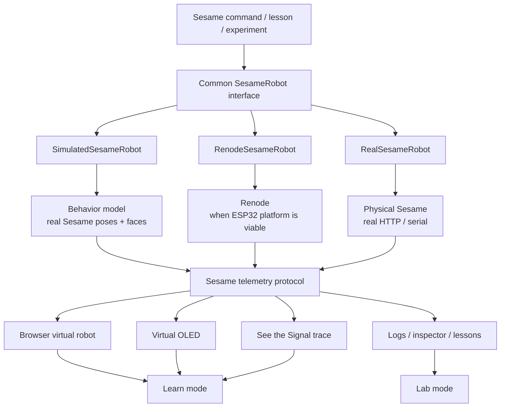
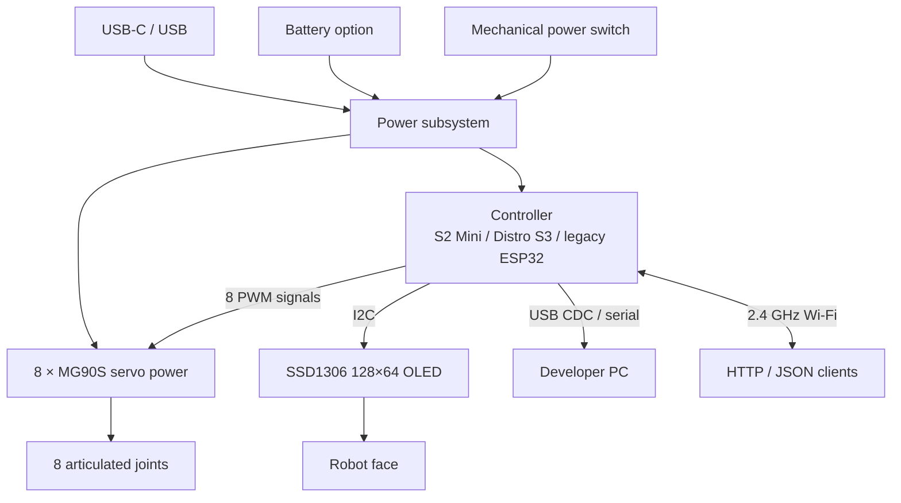
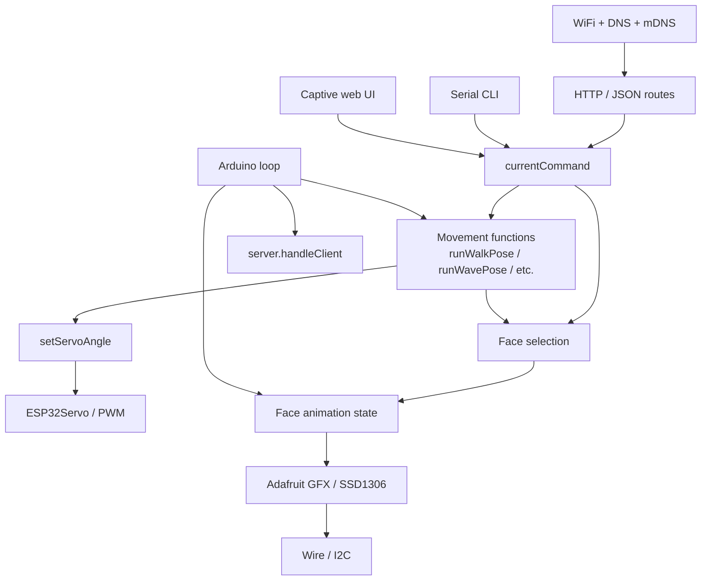
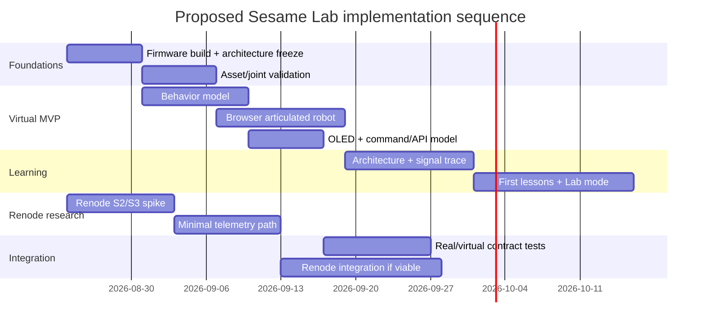

# Sesame Lab: Emulator, Virtual Robot, and Interactive Engineering Learning Platform

## Executive findings and architecture decision

This report executes the attached research specification as an implementation-oriented study of Sesame Robot, Renode, firmware emulation, browser simulation, and an educational engineering environment for a technically curious learner around age 12. The requested end state is a continuum from physical hardware through firmware emulation and visualization to guided learning and experimentation. fileciteturn0file0

The most important finding is that **Sesame is simpler at the application layer, and harder at the SoC-emulation layer, than the high-level project description initially suggests**.

The current Sesame repository is an actively evolving ESP32-family quadruped with eight MG90-class servos, a 128×64 SSD1306 OLED, Wi-Fi control, a JSON HTTP API, a serial CLI, animation tooling, CAD/STL assets, and several controller variants. The current DIY recommendation remains the Lolin S2 Mini, while the newest Sesame Distro Board V3.1 uses an **ESP32-S3**, not an ESP32-S2. Older original-ESP32 hardware remains supported as a legacy path. citeturn13view0turn12view0turn2view6

At the firmware level, Sesame is not presently a sophisticated gait-planning or inverse-kinematics stack. Its movement system is primarily a collection of explicit sequences of servo-angle commands and delays. For example, `runStandPose()` and `runWavePose()` directly call `setServoAngle()` for named joints such as `R1`, `R2`, `L1`, `L2`, `R3`, `R4`, `L3`, and `L4`; the canonical wire/action order is `[R1,R2,L1,L2,R4,R3,L3,L4]`. citeturn13view3 This turns out to be excellent news for a virtual Sesame: a high-value behavioral simulator can reproduce the real movement semantics without reproducing the entire ESP32 first.

Renode is more problematic. Current Renode releases support the Xtensa architecture, and Renode 1.16.1 added an ESP32 UART model, but the official supported-board catalog contains no ESP32 entry, and an open Renode issue continues to distinguish “Xtensa translation support” from a usable complete ESP32 platform. The defensible conclusion as of August 23, 2026 is therefore: **there is no demonstrated official Renode platform on which the unmodified current ESP32-S2 or ESP32-S3 Sesame firmware can simply be loaded and expected to boot.** citeturn0search1turn11view0turn11view2turn12view3turn12view4

That does **not** make Renode irrelevant. It changes its role.

The recommended architecture is **behavioral-simulator-first, Renode-ready**:



The architectural principle is that **Renode becomes one interchangeable robot backend rather than the foundation on which every other feature depends**. This decouples the educational application and virtual robot from the highest-risk research problem.

The recommendation is therefore:

| Decision | Recommendation | Confidence |
|---|---|---:|
| Build a useful virtual Sesame now | **Yes** | Very high |
| Build it in the browser | **Yes** | High |
| Use the real movement/face semantics | **Yes** | Very high |
| Require physics for the first version | **No** | Very high |
| Reproduce the real Sesame REST contract | **Yes, at the adapter layer** | High |
| Treat Renode as the initial backend | **No** | High |
| Run a focused Renode feasibility spike | **Yes, immediately and in parallel** | Very high |
| Assume unmodified S2/S3 Sesame boots in Renode | **No** | Very high |
| Extend Sesame Studio as the primary UI | **No; reuse concepts/data, not its Tkinter UI** | High |
| Reuse the existing Sesame Simulator | **Only after license/build/API gates pass** | High |
| Use one interface for physical/simulated/emulated robots | **Yes** | Very high |
| Target a “digital twin” immediately | **No; evolve toward one incrementally** | Very high |

A useful terminology distinction is important here:

| Term | What it means for Sesame | First-release priority |
|---|---|---:|
| **Firmware emulator** | Compiled Sesame Xtensa firmware actually executes against emulated ESP32 peripherals | Research track |
| **Behavioral simulator** | Host code reproduces Sesame commands, faces, timing, and joint outputs without executing ESP32 instructions | **MVP** |
| **Visualization** | 2D/3D Sesame follows commanded joints and OLED state | **MVP** |
| **Physics simulator** | Mass, gravity, contact, servo dynamics and collisions determine body motion | Later |
| **Digital twin** | Common model combines firmware state, hardware state, interfaces and physical behavior | Long-term |

The smallest compelling prototype should therefore be:

```text
Actual Sesame movement definitions + face assets
                  │
                  ▼
        SimulatedSesameRobot
                  │
          canonical telemetry
                  │
                  ▼
        browser 3D/kinematic Sesame
            + virtual OLED
                  │
                  ▼
             Learn / Lab UI
                  │
                  ▼
 "Wave" → API → pose → servo → joint trace
```

At the same time, a separate Renode spike should attempt:

```text
Sesame or minimal target ELF
              │
              ▼
            Renode
              │
     UART / first peripheral
              │
              ▼
     host telemetry bridge
              │
              ▼
       same browser frontend
```

This produces visible, educationally useful progress even if the Renode spike concludes that complete ESP32-S2/S3 modeling is presently too expensive.

## Sesame robot as it exists today

The primary Sesame repository contains `docs`, `firmware`, `hardware`, and `software`, is Apache-2.0 licensed, and currently describes Sesame as an eight-servo, roughly eight-degree-of-freedom ESP32 quadruped with a 128×64 OLED face, Wi-Fi networking, JSON API, Sesame Studio, Companion App, and serial command interface. citeturn13view0

**A critical hardware-version correction:** the documentation now distinguishes the hand-wired Lolin S2 Mini path from the custom Distro boards. The hand-wired S2 Mini remains recommended for DIY construction; Distro V3/V3.1 is the current kit-oriented board; V2 and V1 are legacy; V1 stacks an ESP32-DevKitC-32E. The PCB documentation specifically says V3.1 uses an **ESP32-S3 processor**, while the S2 Mini is an ESP32-S2 configuration. citeturn12view0turn2view6

**Processor families.** Espressif describes the original ESP32 as Xtensa LX6, ESP32-S2 as a single-core 32-bit Xtensa LX7 typically running at 240 MHz with 320 KB SRAM and 128 KB ROM, and ESP32-S3 as dual-core Xtensa LX7, typically 240 MHz, with 512 KB SRAM and 384 KB ROM. All three families provide 2.4-GHz Wi-Fi; S2 does not provide Bluetooth, whereas S3 provides Bluetooth LE. Flash capacity depends on the exact chip/module variant rather than merely the SoC family. citeturn22search1turn22search11turn22search13

The Sesame firmware documentation directs Arduino users to select `LOLIN S2 Mini` for the DIY build, `ESP32 Dev Module` for Distro V1, and `ESP32S3 Dev Module` for the V2/V3 firmware configuration; it also documents USB CDC and 4-MB SPIFFS-oriented partition settings for current builds. citeturn1view1turn2view0 Exact flash/PSRAM component population on every Distro-board revision should nevertheless be extracted from the PCB schematic/BOM before a Renode memory map is frozen; “ESP32-S3” by itself does not uniquely identify those parameters.

The base BOM calls for eight MG90S all-metal 180-degree micro servos and a 0.96-inch 128×64 SSD1306 I²C OLED. Sesame supports a 5-V-class servo/power architecture through USB or battery conversion depending on board revision; current documentation discusses USB-C PD and 14500 battery configurations, while legacy power schemes have different limitations. citeturn2view7turn12view0turn12view1



The build guide names the printed joints `R1–R4` and `L1–L4`; it identifies `R1`, `R2`, `L1`, and `L2` as the four hip joint pieces. citeturn12view1 The firmware's enum gives the actual control order as:

```cpp
R1 = 0,
R2 = 1,
L1 = 2,
L2 = 3,
R4 = 4,
R3 = 5,
L3 = 6,
L4 = 7
```

That non-geometric order is worth preserving explicitly in the simulator rather than assuming `R1,R2,R3,R4,L1,L2,L3,L4`. citeturn13view3 A recent independent Apache-2.0 Sesame simulation project, Sesame ML, independently uses the same firmware/wire/action order, which is useful corroboration. citeturn15search4

**Actual firmware pin configuration.** The checked-in current firmware has the S2 Mini configuration active. It defines servo pins `{1,2,4,6,8,10,13,14}` and I²C SDA/SCL as GPIO 33/35. Commented board configurations show Distro V3 servo pins `{4,5,6,7,10,11,12,13}` and I²C 8/9, Distro V2 `{4,5,6,7,15,16,17,18}`, and V1 `{15,2,23,19,4,16,17,18}`. citeturn13view2

That gives a practical emulation-priority table:

| Component | Real interface | Current firmware dependency | Important behavior | Renode treatment | Priority |
|---|---|---|---|---|---:|
| Xtensa CPU | SoC core | Arduino/ESP-IDF runtime | Executes all firmware | Native Xtensa exists, SoC platform incomplete | Critical for firmware emulation |
| Flash/ROM/RAM | SoC bus | Bootloader, Arduino core | Boot and runtime image | Correct S2/S3 memory/ROM behavior required | Critical |
| Eight MG90S servos | 50-Hz PWM from 8 GPIOs | `ESP32Servo` | Target angle; no position feedback in base robot | Capture PWM or instrument higher-level calls | **Critical for visible MVP** |
| SSD1306 OLED | I²C, address `0x3C` | `Wire`, Adafruit GFX/SSD1306 | 128×64 framebuffer | Mock/intercept I²C or model controller | **High** |
| UART / USB CDC | serial stream | `Serial` | boot logs, CLI, debug | ESP32 UART model now exists; USB CDC is harder | High |
| Wi-Fi | ESP32 integrated radio/stack | `WiFi`, `WebServer`, DNS, mDNS | AP/STA and real HTTP API | Mock/proxy initially | High for parity, low for first visualization |
| DNS/mDNS | UDP/network stack | `DNSServer`, `ESPmDNS` | captive portal/discovery | Skip initially | Low |
| Power switch | electrical | none in normal application logic | on/off | UI toggle only | Low |
| Sensors | none required by base firmware | none central | future expansion | Generic extension interface | Low |
| USB OTG | SoC peripheral on S2/S3 | upload/CDC depending setup | development connection | Major modeling effort if exact | Low for MVP |

Espressif's S2 and S3 LEDC peripherals each provide eight independent PWM channels, and the S2/S3 hardware routes peripheral signals through flexible GPIO-matrix structures. citeturn22search3turn22search5turn22search7 Sesame itself uses `ESP32Servo`, allocates four PWM timers, sets each servo to 50 Hz, and attaches servos using approximately 732–2929 µs endpoints. citeturn2view0turn4view5

The current `setServoAngle()` operation is particularly simulator-friendly: it adds per-servo subtrim, constrains the result to 0–180 degrees, calls the servo library's `write()`, and then performs a configurable delay intended to reduce power-current surges. The default `motorCurrentDelay` is 20 ms. citeturn13view2turn4view3

Consequently, for an educational digital representation the truthful state is not “measured servo angle”; the stock robot has no joint-position feedback in this architecture. A simulator should distinguish:

```json
{
  "servo": "R4",
  "commandedAngleDeg": 72,
  "simulatedAngleDeg": 68,
  "measuredAngleDeg": null
}
```

`simulatedAngleDeg` can lag the command using a configurable speed model, while `measuredAngleDeg` remains `null` unless future physical hardware supplies feedback. That distinction prevents the educational UI from implying sensing that the real Sesame does not possess.

**OLED architecture.** The source defines a 128×64 display at I²C address `0x3C`, backed by `Adafruit_SSD1306`. Face frames are bitmap arrays; the firmware supports multiple frames per expression and per-face frame rates/modes such as loop, once, and boomerang. Rendering clears the display, draws the bitmap, and updates the SSD1306. citeturn13view2turn5view3turn5view4

An important emulation dependency follows from startup order: `setup()` starts serial, initializes I²C, initializes the SSD1306, and enters an infinite failure path if OLED allocation/initialization fails; only after that does it continue into Wi-Fi, server setup, servo timer allocation and servo attachment. citeturn4view1turn4view5 A “full firmware boot” experiment therefore cannot ignore the display boundary unless the firmware is temporarily instrumented or patched.

**Firmware structure.** The documented firmware is intentionally compact: the main `.ino` contains initialization, loop, networking and API control; `movement-sequences.h` contains poses/movements; `face-bitmaps.h` contains display artwork; and `captive-portal.h` contains the local web UI. citeturn1view1

The practical architecture is closer to this than to a layered robotics framework:



There are **no application-created robotics threads/tasks or planner subsystems visible in this main architecture**. The application loop cooperatively handles DNS, HTTP clients, face updates and the current movement command. citeturn4view2

Likewise, the current “animation engine” should not be described to learners as a gait generator. `movement-sequences.h` defines named servo indices and direct procedural choreography. `runStandPose()` writes eight fixed angles; `runWavePose()` goes to stand, changes selected joints, delays, then alternates one joint several times. Walking similarly consists of angle sequences and timing rather than inverse kinematics. citeturn13view3turn5view0turn5view1

That is pedagogically powerful: a student can literally trace

```text
Wave
  ↓
runWavePose()
  ↓
setServoAngle(L3, ...)
  ↓
ESP32Servo.write(...)
  ↓
PWM pulse
  ↓
joint rotates
```

without having to understand a matrix-based walking controller first.

**Networking.** The firmware uses `WiFi`, `WebServer`, `DNSServer`, and mDNS, supports AP plus optional station networking, runs an HTTP server on port 80, and exposes legacy and JSON-oriented routes. citeturn4view4turn4view5 Relevant routes include:

| Route | Role |
|---|---|
| `GET /` | captive/local control UI |
| `GET /cmd?...` | legacy command mechanism |
| `GET /getSettings` | retrieve settings |
| `GET /setSettings` | update settings |
| `GET /api/status` | JSON-style status endpoint |
| `POST /api/command` | JSON command/face control |

The documentation shows `POST /api/command` accepting command/face data, while the source implements body handling directly around `server.arg("plain")`. Current source also performs relatively lightweight/manual string parsing rather than introducing a large JSON-document dependency. citeturn2view3turn5view5turn5view6

There is documentation drift worth fixing before freezing training content: current source defines AP SSID `Sesame-Controller`, whereas some firmware documentation still shows `Sesame-Controller-BETA`. citeturn4view4turn2view2 Lessons should therefore be generated against a pinned upstream commit, not hand-authored against mutable README prose.

The current networking model is local HTTP without HTTPS/authentication; that is acceptable for a toy on a trusted LAN but means a Sesame Lab compatibility proxy should bind to localhost by default and should not casually publish a real robot control API onto a wider network. citeturn2view2

**Sesame Studio.** Studio is a small Python 3 desktop animation composer using Tkinter and Pillow. It presents top-down/lateral schematic guides, color-coded S0–S7 controls, accepts 0–180° servo values, adds timed frames, and generates `setServoAngle()` C++ for pasting into Arduino firmware. citeturn13view1 It is therefore valuable as a specification of the project's mental model—pose + delay + sequence—but its Tkinter UI is not a strong foundation for a browser educational product.

The correct reuse strategy is to preserve Studio concepts:

```text
Pose = eight servo angles
Frame = pose + duration/delay
Animation = ordered frames
Export = Sesame-compatible movement commands
```

but reimplement the editor as a shared TypeScript component connected directly to virtual or real Sesame. This eliminates today's copy-to-clipboard workflow while preserving compatibility.

**Companion App.** The official project describes the Companion App as Python software using Sesame's JSON/network mode for remote control, faces and voice-assistant experimentation. It is useful mainly as a client/API reference and parity-test target, not as the simulator architecture. citeturn14view0

**Existing Sesame Simulator.** This deserves much more attention than a normal README summary. The official Sesame repository links to a simulator by Jay Li and describes it as Rust-based, browser-capable, physics-based and URDF-driven. citeturn14view0 The actual repository is `one-for-all/sesame-robot-sim`; it contains 33 commits, Rust/C/C++/TypeScript code, `src`, `www`, `onshape`, a `sesame` directory and no published releases in the surfaced repository metadata. citeturn17view1

More importantly, its `Cargo.toml` reveals:

```text
Rust library, cdylib + rlib
wasm-bindgen + web-sys
urdf-rs
nalgebra
local gorilla-physics dependency
local esp32rs dependency
servo_sim binary
URDF binary
```

The repository also contains `repro_uart.rs`, `servo_sim.rs`, and a copied `sesame.ino` plus `movement-sequences.h`. citeturn18view0turn19view0turn19view1 This strongly suggests the project has explored a deeper firmware/ESP32/physics integration than the primary Sesame README communicates.

There are, however, two immediate blockers to treating it as a reusable product foundation. First, `Cargo.toml` refers to sibling-path dependencies `../gorilla-physics/` and `../esp32rs/`, so a plain clone is not evidently self-contained. Second, no `LICENSE` file is visible in the surfaced root listing. That means **code reuse should be considered legally unapproved until its license is confirmed**, regardless of the official Sesame repository linking to it. citeturn17view1turn18view0

The old GitHub Pages URL now redirects to another simulator domain, indicating that the deployment has moved, but the fetched redirect did not expose enough material to establish the production build architecture. citeturn17view0

A second 2026 project, **Sesame ML**, deserves a serious asset/reference spike. It is Apache-2.0, explicitly experimental, and supplies Sesame-derived meshes, a MuJoCo MJCF, a validated URDF, joint/frame conventions, simulation/testing tooling, and the same wire/action ordering used by the firmware. citeturn15search4 For a new open-source Sesame Lab, its licensing and ready-made articulated descriptions may make it a lower-friction source of simulation geometry than the older simulator, provided its transforms are checked against physical Sesame.

## Renode feasibility and emulator trade study

Renode models a virtual system as a machine containing a CPU, memory/system bus and peripheral objects. Platform-description `.repl` files instantiate/register devices and connect buses, GPIOs and interrupts; `.resc` scripts automate creating machines, loading platforms and firmware, starting analyzers and running workflows. citeturn8search0turn8search1

For Sesame, the most relevant Renode capabilities are:

| Capability | Sesame use |
|---|---|
| CPU instruction execution | run compiled Xtensa firmware |
| `.repl` platform descriptions | represent the ESP32-S2/S3 address map/peripherals |
| `.resc` scripts | reproducible Sesame boot/test setup |
| ELF loading | run symbol-rich Sesame firmware builds |
| Monitor | inspect/control emulation interactively |
| UART analyzers/sockets | logs, CLI, telemetry bridge |
| GDB server | source-level firmware debugging |
| snapshots | preserve teaching/debugging states |
| virtual time | deterministic timing tests |
| Python peripherals | rapid prototypes/mocks |
| C# peripherals | production-quality device models |
| Robot Framework integration | boot/API/regression tests |

Renode's time framework advances virtual rather than wall-clock time and coordinates emulated components against that clock, which is one reason it is attractive for reproducible firmware tests. citeturn8search2 Snapshots can serialize emulation state for later restoration, while the Monitor gives interactive access to the emulated object hierarchy and can be extended with Python. citeturn8search6turn8search10 Renode can also expose UARTs through host network sockets on all supported host platforms, making UART an unusually convenient Windows-compatible integration boundary. citeturn8search12

The problem is the **ESP32 SoC**, not Renode's general architecture.

Current Renode identifies Xtensa among supported CPU architectures. Renode 1.16.1, released in February 2026, added an ESP32 UART peripheral model and experimental Xtensa assembler/disassembler improvements. citeturn0search1turn11view2 But Renode's current supported-board documentation has no `ESP32` match, and a public issue asking whether recent Xtensa/ESP32 translation work means ESP32 boards are now actually supported remains open. citeturn12view3turn12view4turn11view0

CPU translation support and complete SoC support are fundamentally different:

```text
Xtensa instruction execution       ✓ exists
              │
              ▼
ESP32-S2/S3 CPU integration        ?
              │
              ▼
interrupt controller               ?
timers / clocks                    ?
GPIO matrix                        ?
LEDC PWM                           ?
I2C                                ?
SPI / flash                        ?
ROM functions                      ?
efuses                             ?
USB                                ?
Wi-Fi MAC/radio                    ?
bootloader environment             ?
              │
              ▼
Arduino-ESP32 runtime              ?
              │
              ▼
Sesame firmware                    ?
```

Accordingly, the current feasibility matrix should be treated as follows. “New model” here is a research classification, not a claim that Renode lacks every reusable generic building block; an ESP32 source-tree audit during the spike may downgrade individual items.

| Requirement | Current classification | Sesame impact |
|---|---|---|
| Xtensa instruction translation | **Supported directly** | Necessary but insufficient |
| Complete ESP32-S2 platform | **Not demonstrated / likely new platform work** | Research blocker |
| Complete ESP32-S3 platform | **Not demonstrated / likely new platform work** | Research blocker |
| Lolin S2 Mini definition | **Requires configuration/platform work** | No board definition found |
| Distro V3.1/S3 definition | **Requires configuration/platform work** | Custom board |
| ESP32 UART | **Direct model exists; S2/S3 compatibility must be tested** | Useful |
| Interrupt controller | **Needs source audit/modeling** | Boot blocker |
| timers/system clocks | **Needs source audit/modeling** | Boot/runtime blocker |
| GPIO matrix | **Needs SoC modeling** | Servo and I²C routing |
| LEDC PWM | **Likely new model** | Servo output |
| I²C controller | **Likely new ESP32 model/integration** | OLED boot blocker |
| SSD1306 external device | **Mock/custom device reasonable** | Straightforward compared with SoC |
| SPI/flash controller | **Likely substantial platform work** | Boot |
| boot ROM/ROM calls | **Substantial correctness work possible** | Boot/Arduino runtime |
| USB CDC/USB OTG | **Difficult / defer** | Not required for MVP if UART works |
| Wi-Fi radio/driver environment | **Difficult / major effort** | Mock for MVP |
| DNS/mDNS | **Mock at host/network layer** | Low priority |
| servo mechanics | **Mock/behavioral model** | Easy once command captured |
| GDB | **Supported Renode feature** | Excellent debugging value |
| UART-to-host socket | **Supported directly** | Best initial bridge |
| deterministic virtual time | **Supported directly** | Excellent automated testing |
| snapshots | **Supported directly** | Useful educational debugger |

The ESP32-S2/S3 LEDC dependency is particularly consequential. Espressif documents eight LEDC PWM channels on both S2 and S3; Sesame uses eight servos through `ESP32Servo`, so true unmodified-firmware emulation ultimately needs the calls made by that library to encounter sufficiently correct timer/LEDC/GPIO behavior. citeturn22search5turn22search7turn13view2

The OLED is another early boot dependency. The firmware performs SSD1306 initialization before setting up the HTTP server and servos, and stops if display initialization fails. citeturn4view1 Thus “let's first boot everything except the display” is not an unmodified-firmware path.

**Can unmodified Sesame firmware boot in Renode today?**

The answer should be recorded as:

> **Unknown experimentally, not demonstrated by official Renode support, and unsafe to assume. Based on the absence of an official ESP32 board platform and the limited ESP32-specific model additions visible in current release material, successful boot of current S2/S3 Sesame firmware likely requires additional SoC/peripheral engineering.** citeturn11view0turn11view2turn12view4

That wording is deliberately stronger than “maybe” but weaker than an unverified absolute “impossible.”

The engineering estimate is correspondingly asymmetric:

| Work | Research estimate |
|---|---:|
| prove whether an existing Renode ESP32 branch/platform can run minimal code | 1–3 engineer-days |
| load a minimal S2/S3 ELF and get first UART evidence | 2–5 days if platform pieces exist |
| make a minimal Sesame-specific platform reach `setup()` | 1–3 weeks if only a few models are missing |
| implement GPIO/LEDC/I²C/flash/interrupt pieces from scratch | several engineer-weeks |
| reproduce enough Wi-Fi behavior for unmodified Arduino networking | potentially several additional weeks/months |
| full production-quality S2/S3 SoC fidelity | potentially a multi-month upstream-style effort |

These are planning estimates, not Renode vendor estimates. The first spike is specifically intended to collapse the uncertainty before that schedule is accepted.

**Servo emulation choices.**

| Approach | Fidelity | Complexity | Works before complete ESP32 model? | Recommendation |
|---|---:|---:|---:|---|
| instrument `setServoAngle()` to emit telemetry | Application-level exact | Very low | Yes | **First Renode prototype** |
| capture LEDC/PWM register behavior | Hardware-level useful | Medium/high | Only after LEDC/GPIO exists | Later |
| model PWM wire waveform and decode 50-Hz pulse | Highest relevant electrical fidelity | High | No | Only for peripheral validation |
| behavioral simulator calls same joint-state interface | Functional | Very low | Yes | **Main MVP** |

A minimal instrumented firmware fork could emit something equivalent to:

```text
@SESAME servo R4 72
```

immediately after the real `setServoAngle()` path. The host bridge then publishes:

```json
{
  "type": "servo.target",
  "joint": "R4",
  "angleDeg": 72
}
```

This is preferable to modifying every movement function because it instrumentates the single convergence point through which movements already flow. citeturn4view3turn13view3 Once LEDC exists in Renode, the instrumentation can be removed and the exact same browser protocol can be generated from the emulated peripheral.

**OLED virtualization choices.**

| Method | Firmware fidelity | Effort | Educational visibility |
|---|---:|---:|---:|
| full SSD1306 controller model | High | Medium | Excellent |
| decode I²C transactions into SSD1306 state | High enough | Medium | **Excellent** |
| instrument framebuffer before `display.display()` | Application-level | Low | **Excellent MVP** |
| publish expression name only | Low | Very low | Good for first demo |

The preferred progression is expression-name telemetry → framebuffer instrumentation → I²C transaction decoding → optional reusable SSD1306 model. That lets the educational UI initially say “the firmware chose `wave`” and later let the learner descend into “these bytes crossed I²C and changed these pixels.”

**Renode-to-browser bridge.** Four options are reasonable:

| Bridge | Advantages | Problems | Use |
|---|---|---|---|
| Monitor over telnet | already available; excellent control | internal-control interface; poor browser-facing contract | Control/debug only |
| UART socket | simple, cross-platform, firmware-like | needs telemetry framing | **Recommended first data plane** |
| Python peripheral | rapid prototyping | less appropriate for long-lived high-volume model | Early mocks |
| C# peripheral/model | first-class Renode integration | more Renode-specific engineering | Production emulator |

Renode can expose Monitor over a network port and can expose emulated UART through a host socket. citeturn8search12turn8search13 The robust architecture is therefore:

```text
Renode
  │
  ├── Monitor TCP ──────────────► emulator control adapter
  │
  └── UART TCP ─────────────────► telemetry parser
                                      │
                                      ▼
                               Sesame Bridge
                                      │
                                WebSocket
                                      │
                                      ▼
                                  Browser
```

Do **not** make the browser understand Renode's Monitor language. Keep Renode behind a typed bridge service.

A useful framed protocol would be:

```ts
type SesameTelemetry =
  | {
      type: "servo.target";
      seq: number;
      simTimeUs?: number;
      joint: "R1" | "R2" | "L1" | "L2" | "R4" | "R3" | "L3" | "L4";
      angleDeg: number;
    }
  | {
      type: "face.expression";
      seq: number;
      name: string;
      frame?: number;
    }
  | {
      type: "oled.frame";
      seq: number;
      width: 128;
      height: 64;
      pixels: string;
    }
  | {
      type: "log";
      seq: number;
      channel: "uart" | "firmware" | "emulator";
      text: string;
    };
```

Including emulator virtual time when available makes the frontend deterministic and lets “See the Signal” replay one operation consistently.

**Alternatives if Renode stalls.**

Espressif itself maintains a QEMU fork for the original ESP32. Its official ESP-IDF documentation describes emulation of the ESP32 CPU, memory and several peripherals, `idf.py qemu`, GDB integration and Windows binaries. citeturn22search0turn22search2 This is significant because Sesame still supports the **legacy original ESP32 Distro V1** configuration. It does not, however, establish S2 or S3 parity.

Wokwi supports browser ESP32 simulation and allows users to upload custom `.bin`, `.elf`, or `.uf2` firmware; its docs also provide SSD1306/custom-framebuffer facilities. citeturn23search5turn23search21turn23search23 Searchable public examples demonstrate ESP32-S2 projects, making it an excellent empirical fallback spike even if it is not the open, self-hosted emulator core desired for Sesame Lab. citeturn23search6

The focused trade study is:

| Approach | Original firmware | ESP32 fidelity | Servo visualization | Browser integration | Difficulty | Verdict |
|---|---:|---:|---:|---:|---:|---|
| Full Renode S2/S3 | Potentially yes | Potentially high | Excellent after models | Good via bridge | **Very high/unknown** | Research track |
| Hybrid Renode + telemetry | Mostly yes, small instrumentation | Medium | **Excellent** | **Excellent** | Medium after boot | Best Renode target |
| Espressif QEMU, legacy ESP32 | Yes for compatible target | High for supported original ESP32 areas | Custom integration needed | Medium | Medium | Valuable fallback |
| Wokwi | Yes/custom binary | Good supported-board behavior | Existing electronics UI + hooks | Already browser-hosted | Low/medium | Excellent feasibility benchmark |
| host-native behavioral simulator | No Xtensa execution | Low hardware fidelity | **Excellent** | **Excellent** | **Low** | **Recommended MVP** |
| physics simulator | No firmware unless bridged | Physical rather than SoC fidelity | Excellent | Good | Medium/high | Phase after kinematics |
| WASM behavior model | Recompiled model, not original firmware | Low | Excellent | Excellent | Medium | Good shared-core option |
| PlatformIO alone | Build only | None | None | None | Low | Toolchain, not emulator |

## Virtual robot and common API architecture

The browser is the right primary presentation layer. It gives a learner immediate access from a normal Windows computer, makes lessons and visualization share one UI, and can later connect to local bridge processes for real hardware or Renode.

For the implementation stack, the lowest-complexity long-lived choice is:

```text
React
TypeScript
Vite
React Three Fiber / Three.js
React Flow
WebSocket
ordinary Canvas/SVG for the OLED and signal diagrams
```

React Three Fiber is a React renderer for Three.js, works directly with Vite, provides glTF-loading workflows, and has a test renderer. citeturn23search0turn23search1turn23search10turn23search18 React Flow is MIT-licensed and already supplies node dragging, pan/zoom, selection and interactive edges, making it suitable for an explorable architecture map without developing a graph editor from scratch. citeturn23search4

Do not begin with Rust/WASM, Tauri, Godot or Bevy unless the existing Sesame Simulator passes its reuse gates. They are technically capable, but the educational application is mostly UI/state/3D orchestration, not a workload that requires a WASM-first architecture.

The common robot abstraction should be slightly richer than a collection of methods:

```ts
type JointName =
  | "R1" | "R2" | "L1" | "L2"
  | "R4" | "R3" | "L3" | "L4";

interface SesameCapabilities {
  realHardware: boolean;
  firmwareExecution: boolean;
  oledFramebuffer: boolean;
  serialConsole: boolean;
  httpApi: boolean;
  physics: boolean;
}

interface SesameRobot {
  connect(): Promise<void>;
  disconnect(): Promise<void>;

  capabilities(): Promise<SesameCapabilities>;

  command(name: string): Promise<void>;
  setFace(name: string): Promise<void>;
  setJoint(joint: JointName, angleDeg: number): Promise<void>;
  setPose(pose: Partial<Record<JointName, number>>): Promise<void>;

  getState(): Promise<RobotState>;
  subscribe(listener: (event: SesameTelemetry) => void): () => void;
}

class RealSesameRobot implements SesameRobot { /* HTTP/serial */ }
class SimulatedSesameRobot implements SesameRobot { /* host behavior */ }
class RenodeSesameRobot implements SesameRobot { /* bridge */ }
```

This provides a useful architectural invariant:

```text
Lesson code
Architecture diagram
REST console
Animation editor
Automated tests
       │
       ▼
   SesameRobot
       │
 ┌─────┼────────┐
 ▼     ▼        ▼
Real   Sim    Renode
```

The virtual implementation should also expose a compatibility HTTP server implementing the same key routes as physical Sesame, especially `/api/status` and `/api/command`. The physical firmware already defines those routes. citeturn2view3turn4view5 That means external applications can eventually choose between:

```text
http://physical-sesame/api/command
```

and

```text
http://localhost:<virtual-port>/api/command
```

without changing command semantics.

The browser itself does not need to reach an emulated Wi-Fi radio. That distinction is crucial:

```text
                  Sesame-compatible API
                          │
           ┌──────────────┴──────────────┐
           ▼                             ▼
Physical firmware HTTP           Host compatibility proxy
                                          │
                                  Renode / simulator
```

This creates API parity immediately while leaving exact Wi-Fi emulation as an advanced research problem.

**Robot-state model.** Define one canonical state independent of transport:

```ts
interface RobotState {
  mode: "real" | "simulated" | "renode";

  joints: Record<JointName, {
    commandedDeg: number;
    simulatedDeg?: number;
    measuredDeg?: number;
    subtrimDeg?: number;
  }>;

  face: {
    expression: string;
    frame: number;
    width: 128;
    height: 64;
  };

  network: {
    state: "unavailable" | "ap" | "station" | "simulated";
    ip?: string;
  };

  motion: {
    command?: string;
    sequenceStep?: number;
  };
}
```

Do not use front-left/front-right names as the canonical serialization until a verified mechanical mapping from `R1`–`L4` to spatial leg/joint semantics is committed alongside the model. Instead store both once verified:

```ts
{
  firmwareName: "R1",
  semanticName: "right_front_hip"
}
```

That prevents the viewer from baking in a guessed mapping.

**Asset pipeline.** The official project supplies CAD/STL material and the build guide describes eleven printed pieces including the internal frame, covers and eight named joints. citeturn13view0turn12view1 The old Sesame Simulator claims URDF integration, while the newer Apache-2.0 Sesame ML repository provides an explicit validated URDF, MJCF and derived meshes. citeturn14view0turn15search4

Recommended pipeline:

```text
official CAD/STL
      │
      ├──────────► verify dimensions/joint pivots
      │
Sesame ML URDF ─► verify axes/limits
      │
      ▼
Blender / conversion script
      │
      ▼
named articulated hierarchy
      │
      ▼
GLB / glTF
      │
      ▼
React Three Fiber
```

R3F directly supports glTF loading and can convert loaded scene structures into React components, making GLB/glTF a much better browser runtime format than independently loading eight or more raw STL meshes. citeturn23search1

Maintain meaningful object names:

```text
sesame_body
R1
R2
L1
L2
R4
R3
L3
L4
oled_screen
```

and add semantic aliases after physical validation.

**Kinematics before physics.** For the MVP:

```text
firmware target angle
        ↓
optional speed/lag model
        ↓
joint rotation
        ↓
forward transforms
        ↓
3D pose
```

This is deterministic, easy to explain, and mirrors the fact that today's firmware itself commands angles rather than doing dynamic torque control. citeturn4view3turn13view3

Physics belongs in a later experimentation layer:

| Stage | Motion model | Purpose |
|---|---|---|
| MVP | direct joint-angle kinematics | lessons, pose/face/API experiments |
| next | joint velocity/speed limits, simple ground constraint | more believable animation |
| advanced | rigid-body contacts/gravity | gait/balance experimentation |
| research | calibrated mass/torque/friction, hardware comparison | sim-to-real/digital twin |

The old simulator is already described as physics-based and depends on `gorilla-physics`; Sesame ML supplies MuJoCo models and simulation tooling. citeturn14view0turn18view0turn15search4 Therefore a new team should not write its own physics engine. Either rehabilitate a licensed existing Sesame simulation stack or attach a maintained physics backend later.

**Existing Simulator reuse gate.**

The architecture

```text
Sesame firmware
      ↓
Renode
      ↓
simulation bridge
      ↓
existing Sesame Simulator
```

is conceptually feasible because the existing simulator already has servo-simulation, URDF and WASM-related components. citeturn18view0turn19view1 But it should become the official visualization backend only if these questions pass:

1. A license allowing reuse is identified.
2. A clean checkout can build reproducibly, including `esp32rs` and `gorilla-physics`.
3. Its joint ordering is mapped exactly to current firmware.
4. Its web API can accept external joint-state commands.
5. It remains maintainable on current Rust/WASM toolchains.
6. A minimal browser embedding is simpler than the R3F alternative.

Until those pass, use its design as a reference, not a dependency.

**OLED in the browser.** The virtual OLED does not require WebGL. A 128×64 logical framebuffer rendered into a scaled `<canvas>` is simpler and makes individual pixels inspectable. At 8× visual scaling the student gets a 1024×512 face while preserving exact logical coordinates.

**See the Signal telemetry.** Every user-originated action should carry a causal trace ID:

```json
{
  "traceId": "wave-0042",
  "type": "ui.command",
  "command": "wave"
}
```

Subsequent layers emit:

```text
ui.command        Wave
http.request      POST /api/command
firmware.command  wave
movement.enter    runWavePose
servo.target      L3=180
pwm.output        channel=6 pulse=...
joint.target      L3=180
visual.joint      L3=...
```

A behavioral backend can synthesize the first version of this trace from known architecture. A future Renode backend should substitute observed emulator events wherever they exist. The UI should visually distinguish:

```text
OBSERVED FROM EMULATOR
SIMULATED
INFERRED FOR EXPLANATION
```

so teaching fidelity improves rather than silently changing.

**Virtual Sesame UX.** A more useful layout than a single dashboard is a three-pane engineering workbench:

```text
+------------------------------------------------------------------+
| Sesame Lab     [Learn] [Lab]     Robot: Virtual ▼     ● Connected|
+----------------------+-------------------------+------------------+
|                      |                         |                  |
|  Interactive 3D      | Architecture / Signal   | State Inspector  |
|  robot               | trace                   | R1  135°         |
|                      |                         | R2   45°         |
|  click any joint     | HTTP → command → pose  | ...              |
|                      |        → PWM → R4       |                  |
+----------------------+-------------------------+------------------+
| OLED 128×64          | Command / Serial / API console             |
+----------------------+---------------------------------------------+
| Walk | Wave | Dance | Stand | Pose Editor | Face Editor           |
+------------------------------------------------------------------+
```

A component clicked in any pane should highlight its corresponding representation everywhere else:

```text
click R4 in 3D
    ↕
highlight R4 node in architecture
    ↕
show R4 firmware calls
    ↕
show PWM state
    ↕
show R4 angle in inspector
```

This cross-linking is more educationally valuable than adding decorative game elements.

## Learning application and curriculum design

The target experience should be **“an engineering lab with training wheels,” not “software for small children.”** CAST's UDL guidance emphasizes learner choice/autonomy, authentic relevance, calibrated challenge/support and action-oriented feedback; its research basis specifically connects meaningful choice with engagement and agency. citeturn24search1turn24search3turn24search12turn24search14 Scratch's educational tradition likewise emphasizes experimentation, iteration, testing/debugging, reuse/remixing and project-oriented construction rather than merely consuming lessons. citeturn24search0

For a technically interested 11–14-year-old, that translates into:

- short explanations immediately adjacent to something manipulable;
- a visible cause-and-effect loop after almost every action;
- optional deeper detail rather than mandatory walls of text;
- authentic Sesame code, pins, protocols and numbers;
- meaningful choices about what to build;
- debugging as a normal engineering activity, not “failure”;
- challenges that unlock because the learner demonstrated a concept, not because a progress timer elapsed.

CAST specifically recommends choice aligned with the learning goal rather than choice for its own sake, and emphasizes feedback that drives the learner's next action. citeturn24search1turn24search14

The visual direction should therefore resemble a modern lightweight IDE, robotics dashboard or game-development tool:

```text
dark or neutral workspace
clean typography
high-contrast state indicators
realistic 3D robot
small amount of motion
technical labels
hover/click explanations
optional "go deeper"
```

Avoid oversized cartoon buttons, mascot-driven narration, fake currencies, confetti for trivial clicks, and long forced walkthroughs.

**Three explanatory levels** can coexist in the same content system:

| Topic | Beginner around age 12 | Beginner programmer | Architecture view |
|---|---|---|---|
| ESP32 | Sesame's small computer/brain | runs `setup()` and `loop()` | Xtensa SoC + memory/peripherals |
| firmware | instructions that live on the robot | C++/Arduino program | application atop Arduino-ESP32/ESP-IDF |
| servo | a joint you can command to an angle | `setServoAngle(R1, 135)` | PWM via ESP32Servo/LEDC |
| PWM | repeated pulses that encode a requested position | pulse width corresponds to target | timer/LEDC/GPIO waveform |
| I²C | two-wire conversation with the display | address + bytes | controller transaction to SSD1306 |
| API | messages another program sends the robot | HTTP + JSON | transport/contract decoupled from implementation |
| emulator | pretend electronics that run real firmware | CPU + peripherals in software | instruction-level virtual platform |
| simulator | software model of what Sesame does | state/pose model | behavioral or physical model |
| state | what the robot currently remembers | variables/objects | authoritative model + events |

The curriculum should be reordered around **Sesame's actual architecture**, not generic robotics.

| Module | Main experience | Real Sesame concept |
|---|---|---|
| Meet Sesame | rotate/explode 3D robot | eight joints, body, OLED, controller |
| Inside the brain | click CPU/memory/GPIO | ESP32-S2/S3 variants |
| Command one joint | slider moves R1 | `setServoAngle()` |
| How PWM asks a servo to move | pulse-width visualizer | 50-Hz servo control |
| Build a leg pose | coordinate two joints | hip/leg relation |
| Make four legs cooperate | inspect stand/wave | procedural pose sequences |
| Build a movement | frame editor | same idea as Sesame Studio |
| Sesame's face | pixel editor | 128×64 bitmap |
| Two wires to a face | animated bytes | I²C + SSD1306 |
| Read the firmware | clickable real code | `.ino` + movement header |
| Talk over serial | console experiment | serial CLI |
| Put Sesame on a network | AP/station visual | Wi-Fi/IP concepts |
| Send an HTTP command | request builder | `/api/command` |
| Read JSON state | inspect response | API contract |
| Debug a robot | injected failures | calibration/I²C/API mistakes |
| Real versus virtual | backend switch | same `SesameRobot` contract |
| What an emulator really is | CPU/peripheral explainer | Renode |
| Inside Renode | step virtual machine | bus/memory/peripheral/time |
| Build your own experiment | unrestricted Lab | synthesis |

A particularly important curriculum correction is to teach **movement sequencing before inverse kinematics**. The current firmware is itself sequence-oriented. citeturn13view3 Advanced kinematics can then be presented as: “Here is how Sesame works today. How could we improve it?”

**Code exploration.** The source explorer should show a pinned, known-good Sesame commit. For selected teaching files, maintain annotation metadata rather than trying to explain arbitrary C++ with AI at runtime:

```json
{
  "source": "firmware/movement-sequences.h",
  "symbol": "runWavePose",
  "concepts": ["movement", "pose", "servo", "timing"],
  "robotParts": ["L3", "L2", "R1", "R4"],
  "lesson": "wave"
}
```

The learner sees four synchronized panes:

```text
Real source
    ↕
Architecture node
    ↕
Robot part
    ↕
Runtime event
```

This enables questions such as “Which line moved this leg?” and “What moved when this line ran?”

**Interactive architecture view.** React Flow already provides the interaction primitives needed for node/edge diagrams. citeturn23search4 Begin at:

```text
ESP32
 ├─ Movement → 8 Servos
 ├─ Face → OLED
 ├─ Network → HTTP API
 └─ Serial → Developer
```

Clicking `Servos` expands:

```text
Movement function
      ↓
setServoAngle
      ↓
ESP32Servo
      ↓
LEDC / PWM
      ↓
GPIO
      ↓
MG90S
      ↓
joint
```

Clicking `OLED` expands:

```text
Face name
   ↓
bitmap frame
   ↓
Adafruit GFX
   ↓
SSD1306 library
   ↓
Wire
   ↓
I2C
   ↓
SSD1306 controller
   ↓
128×64 pixels
```

The same graph can become the “See the Signal” canvas by animating the active path rather than maintaining two unrelated diagram systems.

**Challenge catalog.** At least these thirty challenges fit the actual architecture:

| Level | Challenge | Core concept |
|---|---|---|
| Starter | identify the controller, OLED and eight joints | hardware architecture |
| Starter | click R1 and find it on the robot | naming |
| Starter | move one servo to 45°, 90°, 135° | angle/state |
| Starter | predict what happens before moving R2 | mental model |
| Starter | put all eight servos at 90° | pose |
| Starter | reproduce the stand pose | multi-joint coordination |
| Starter | change one pixel on the OLED | framebuffer |
| Starter | draw a 5×5 smile | coordinates |
| Starter | choose a built-in expression | face state |
| Starter | press Wave and trace which joints move | movement sequence |
| Explorer | create a three-frame pose sequence | sequencing |
| Explorer | alter frame timing and compare motion | timing |
| Explorer | use subtrim to fix a misaligned virtual joint | calibration |
| Explorer | inspect the 50-Hz PWM visualization | PWM |
| Explorer | match pulse width changes to angle changes | signal interpretation |
| Explorer | send `stand` through the serial console | CLI |
| Explorer | send a valid `/api/command` request | HTTP |
| Explorer | repair malformed JSON | serialization |
| Explorer | read `/api/status` and identify state | API response |
| Explorer | distinguish AP mode from station mode | networking |
| Explorer | find why an OLED at the wrong I²C address stays blank | I²C/debugging |
| Builder | reproduce Wave in the animation editor | source-to-tool mapping |
| Builder | create a new dance without exceeding angle limits | composition/safety |
| Builder | export equivalent Sesame C++ | code generation |
| Builder | trace HTTP → movement → servo | architecture |
| Builder | compare physical and virtual pose outputs | parity |
| Advanced | capture a servo telemetry event from an emulated run | emulation |
| Advanced | pause/restore a Renode snapshot | state/time |
| Advanced | intentionally stub a peripheral and diagnose boot | platform modeling |
| Advanced | write one real/virtual contract test | abstraction/testing |

Badges, if present, should correspond to capabilities such as **Servo Calibrator**, **API Explorer**, **Signal Tracer**, or **Firmware Debugger**, not arbitrary points. That keeps rewards connected to engineering identity and demonstrated competence, consistent with meaningful-choice/actionable-feedback principles. citeturn24search1turn24search14

**Learn and Lab should be two modes of one application.**

`Learn` is guided:

```text
goal
→ short concept
→ interact
→ predict
→ run
→ observe
→ explain
→ small variation
```

`Lab` removes most guardrails and exposes:

```text
3D robot
joint controls
pose/animation editor
OLED editor
REST console
serial console
source explorer
signal trace
architecture explorer
state inspector
backend selector
emulator controls
```

The student's work in Learn should become editable projects in Lab. This avoids the common educational-software failure where completing the curriculum leaves nothing interesting to do.

## Implementation roadmap, testing, and development environment

The architecture should be implemented as a TypeScript-centric monorepo with Renode and firmware tooling alongside it:

```text
sesame-lab/
│
├── apps/
│   └── web/
│       ├── src/learn/
│       ├── src/lab/
│       ├── src/robot/
│       ├── src/architecture/
│       ├── src/source-explorer/
│       └── src/telemetry/
│
├── packages/
│   ├── sesame-model/
│   ├── sesame-protocol/
│   ├── sesame-api/
│   ├── sesame-lessons/
│   └── sesame-assets/
│
├── simulator/
│   ├── behavior/
│   ├── assets/
│   └── validation/
│
├── emulator/
│   ├── renode/
│   │   ├── platforms/
│   │   ├── peripherals/
│   │   ├── scripts/
│   │   └── tests/
│   └── bridge/
│
├── firmware/
│   ├── upstream/
│   ├── patches/
│   └── build/
│
├── tests/
│   ├── contract/
│   ├── parity/
│   └── hil/
│
└── docs/
```

A monorepo is preferable initially because the shared protocol, joint conventions, API contract, generated assets and contract tests are the core value. Splitting those across repositories before there are independent release cycles would increase version-management overhead without producing useful isolation.

The firmware copy should not silently fork upstream. Use one of:

```text
firmware/upstream/   pinned git submodule/reference
firmware/patches/    tiny instrumentation patches
```

or an automated clone-at-known-commit script. Educational annotations must identify the exact Sesame commit they describe.

**Emulator implementation phases.**

| Phase | Objective | Implementation / files | Difficulty | Completion test |
|---|---|---|---:|---|
| Build baseline | reproduce Sesame toolchain | Arduino CLI/IDE config, pinned libraries | Low | deterministic ELF/bin/map generated |
| Boundary inventory | freeze pins/dependencies | firmware audit + `hardware-map.json` | Low | every servo/OLED/network boundary documented |
| Renode probe | establish actual S2/S3 status | minimal `.repl/.resc`, tiny ELF | High/unknown | first instruction/UART or documented blocker |
| Sesame boot probe | find first unsupported block | load Sesame ELF, traces/GDB | High | reach defined boot milestone |
| Telemetry hook | expose one joint | instrument `setServoAngle()` or modeled peripheral | Medium | browser receives one joint event |
| OLED hook | export expression/frame | framebuffer or I²C hook | Medium | browser matches selected face |
| Bridge | stable Renode/browser protocol | Node/Python host service | Low | reconnectable WebSocket stream |
| API parity | emulate Sesame API externally | `sesame-api` adapter | Medium | same contract suite passes virtual/physical |
| Peripheral fidelity | replace instrumentation | LEDC/I²C/GPIO models | High | uninstrumented firmware drives outputs |
| Regression suite | automate boot and behavior | Renode/Robot/contract tests | Medium | CI catches behavior regressions |

Renode's deterministic virtual time, UART exposure, GDB support, Monitor and test automation are the primary reasons to continue this track even if the SoC work takes time. citeturn8search2turn8search12turn8search16turn0search1

**Training application stages.**

| Stage | Exact features | Validation |
|---|---|---|
| Browser foundation | R3F Sesame viewer, joint inspector, OLED canvas | all eight named joints selectable; exact 128×64 display |
| Behavior backend | stand/wave/dance/face behavior from real source | command snapshots agree with firmware definitions |
| Learn foundation | component explorer, architecture graph, first six lessons | learner can trace one action end-to-end |
| Engineering Lab | servo sliders, pose editor, OLED editor, API console | unrestricted experiments persist/reload |
| Code/trace | source annotations + See the Signal | source line ↔ event ↔ robot part linkage |
| Physical backend | real Sesame HTTP/serial adapter | contract suite passes on hardware |
| Renode backend | bridge to emulator | same frontend works with backend switch |
| Advanced debugging | fault injection, snapshots, emulator internals | learner can diagnose prescribed failures |

The browser 3D stack has straightforward Vite integration and direct glTF support. citeturn23search0turn23search1

A realistic staged schedule for one experienced developer, expressed as planning ranges rather than promises, is:



A two-person team can parallelize browser/education work against the emulator spike particularly well because the `SesameRobot` and telemetry contracts deliberately isolate them.

**Resource estimate by deliverable.**

| Deliverable | Primary skills | Rough effort |
|---|---|---:|
| reproducible firmware build | Arduino/ESP32 | 2–4 days |
| kinematic virtual Sesame | TypeScript/3D | 2–3 weeks |
| first six polished lessons | frontend/content/UX | 2–3 weeks |
| API + physical adapter | TypeScript/networking | 3–6 days |
| Renode viability answer | embedded/Renode | 3–10 days |
| simple instrumented Renode bridge, assuming boot | embedded + host bridge | 1–2 weeks |
| missing S2/S3 peripheral work | Renode/C# + ESP32 expertise | weeks to months |
| first physics integration | robotics/physics | 1–3 weeks after usable model exists |

**Windows development environment.** Renode distributes Windows builds, and Espressif's QEMU documentation also describes x86-64 Windows binaries. citeturn0search1turn22search0 The lowest-friction setup is therefore:

```text
Windows 11
├─ Git
├─ VS Code
├─ Node LTS + pnpm/npm
├─ Arduino CLI / Arduino IDE
├─ Python
├─ native Renode
├─ optional Rust toolchain
└─ WSL2 Ubuntu
      └─ CI-like scripts / Linux-only troubleshooting
```

Use **native Windows** for browser development, USB/serial interaction with the physical Sesame, Arduino flashing and interactive Renode work. Keep **WSL2** available for Linux-oriented scripts and CI reproduction. Do not introduce Docker in the MVP unless an emulator dependency specifically needs a controlled Linux image; it would add another boundary around USB, graphics and filesystem access without helping the browser architecture.

**Testing strategy.**

The key idea is one set of behavioral contracts against multiple backends:

```text
                  Contract tests
                       │
           ┌───────────┼───────────┐
           ▼           ▼           ▼
       Physical      Behavior     Renode
        Sesame       simulator     Sesame
```

Firmware tests should compile the pinned upstream firmware and archive ELF, map, binary and toolchain metadata. Simulator tests should validate command→joint outputs, joint bounds and expression/frame state. The web application should test lesson state, robot/backend switching and source-to-component mappings. R3F's ecosystem provides a test renderer for scene-level testing. citeturn23search18

API tests should express contract behavior rather than implementation:

```ts
describeRobotContract(() => realRobot);
describeRobotContract(() => simulatedRobot);
describeRobotContract(() => renodeRobot);
```

Examples:

```text
stand → all eight expected joint targets
wave → expected sequence begins
setFace("rest") → face state becomes rest
invalid command → equivalent error semantics
status → valid canonical state
```

Hardware-in-the-loop should remain opt-in because a physical quadruped can fall or bind. Tests against real Sesame need safe pose limits, an elevated/secured mode where appropriate, an emergency stop/power cut, and clear separation between non-motion and motion suites.

**Reproducibility checklist.**

A build/run should capture:

```text
Sesame upstream commit
Sesame Lab commit
Arduino core version
ESP32Servo version
Adafruit SSD1306/GFX versions
selected controller board
firmware build flags
ELF SHA-256
Renode version
.repl/.resc versions
3D asset source/version
joint-map version
lesson-content version
```

This matters especially because the Sesame firmware docs currently recommend ESP32Servo 3.0.9 and warn about later-library behavior, while project documentation and source already show small configuration drift. citeturn1view1turn4view4

## Risks, technical spikes, decision gates, and first prototype

The risk profile is dominated by emulation, not by the educational frontend.

| Unknown | Risk | Why | Fastest spike |
|---|---:|---|---|
| complete ESP32-S2 execution in Renode | **Research blocker** | no official board platform found | minimal S2 ELF |
| complete ESP32-S3 execution | **Research blocker** | same, plus dual-core SoC differences | minimal S3 ELF |
| boot ROM/flash/interrupt coverage | High | required before Arduino reaches user setup | stop-on-unimplemented-access trace |
| Arduino-ESP32 startup | High | broad SoC dependency surface | empty Arduino `setup()` |
| LEDC/ESP32Servo | High | eight joint outputs depend on it | one 50-Hz servo sketch |
| I²C + OLED | High for unmodified boot | current firmware fails hard on display init | SSD1306-only sketch |
| Wi-Fi | High | complex SoC/radio/network behavior | postpone; API proxy |
| USB CDC | Medium/high | not required if UART works | use UART first |
| simulator reuse license | **Research blocker for reuse** | no root license surfaced | contact/audit repository |
| simulator dependency reproducibility | High | sibling Rust path deps | clean-clone build |
| articulated asset correctness | Medium | joint pivots/axes can be wrong | GLB one-leg test |
| browser↔real robot HTTP access | Medium | local-network/browser policy differences | real-browser API test |
| physical-vs-simulated joint convention | Medium | right/left axes may need sign transforms | pose parity photos/test jig |
| physics accuracy | High | friction/mass/servo torque calibration | deliberately defer |

The first ten engineering experiments should be explicit decision-producing experiments:

| Experiment | Question | Procedure | Pass criterion | Decision |
|---|---|---|---|---|
| Firmware build | Can the current Sesame firmware be reproduced? | pin Arduino core/libs; compile S2 and S3 configurations; retain ELF/bin/map | clean deterministic build | no emulator work before pass |
| Minimal Xtensa | Can current Renode execute the target Xtensa variant? | minimal S2/S3 ELF with known instruction loop | reaches breakpoint/known code | if no, stop full Renode path |
| Minimal UART | Can target firmware produce visible UART in Renode? | tiny serial program | exact message observed | establishes bridge primitive |
| Arduino startup | Can Arduino runtime reach `setup()`? | empty Arduino sketch with UART marker | marker appears | if fail, inventory SoC startup dependencies |
| Sesame early boot | How far does Sesame get? | load Sesame ELF with trace/breakpoints | identify exact first failing block | drives model priority |
| OLED | Can the SSD1306 initialization path succeed? | minimal display sketch/mock | `display.begin()` succeeds and pixels observable | unlocks current Sesame setup |
| Servo | Can one servo command be observed? | minimal `ESP32Servo` or instrumented Sesame | joint + angle event captured | unlocks visualization bridge |
| Browser joint | Can emulator/simulator move a real Sesame mesh? | telemetry → WebSocket → R1 transform | correct joint visibly moves | validates end-to-end architecture |
| Existing sim build | Is old simulator reusable? | clean clone + resolve documented dependencies + license audit | deterministic browser build and acceptable license | reuse or reject |
| Real/virtual parity | Can one command use identical contract? | run `stand`/`wave` against physical and virtual backend | expected state/sequence agrees | confirms common abstraction |

The first four should be run before anyone commits to “Renode is the Sesame emulator.”

The decision gates are:

**Gate A — Renode boot.** Can Renode execute a target S2/S3 Arduino binary far enough to reach user code?

```text
YES → pursue hybrid firmware emulation
NO  → estimate missing CPU/SoC work
        │
        ├─ small → implement
        └─ large → keep Renode as research track
```

**Gate B — servo extraction.** Can a servo target be captured deterministically?

```text
YES → feed common telemetry
NO  → instrument setServoAngle()
```

The instrumentation fallback is intentionally cheap because all major movement functions converge on that function. citeturn4view3turn13view3

**Gate C — existing simulator.** Can `one-for-all/sesame-robot-sim` be legally and reproducibly reused?

```text
license + clean build + external joint API
                 │
              all yes
                 ▼
        adapt visualization
                 
otherwise → build small R3F kinematic viewer
```

Its current local path dependencies and missing surfaced license make this an actual gate, not a formality. citeturn17view1turn18view0

**Gate D — API parity.** Can the virtual backend expose `/api/status` and `/api/command` semantics?

Almost certainly yes at a host proxy irrespective of Renode Wi-Fi, because these are application-level contracts already documented by Sesame. citeturn2view3 Therefore API parity should not wait for radio emulation.

**Gate E — physics.** Does any near-term lesson actually require gravity/contact?

For the proposed first curriculum, no. Direct joint animation is clearer and more deterministic. Physics should remain behind a Lab toggle once it answers a real learning/research question.

**Gate F — source fidelity.** Can every lesson that claims “this is how Sesame actually works” point to a pinned firmware symbol/source location?

If not, label the content as conceptual rather than factual.

The first prototype should combine four highly visible truths:

```text
real movement sequence
real joint names
real OLED expressions
real API vocabulary
```

with a behavioral simulator.

A strong prototype demo would be:

```text
Learner clicks Wave
       │
       ▼
POST /api/command
       │
       ▼
SimulatedSesameRobot
       │
       ▼
runWave-equivalent sequence
       │
       ├── face = wave ──────────► virtual 128×64 OLED
       │
       └── L3 / L2 / R1 / R4 ───► articulated Sesame
                                      │
                                      ▼
                               See the Signal
                        API → movement → servo → joint
```

This is more compelling than spending the same time merely proving that an ESP32 bootloader prints text in a terminal. It demonstrates the eventual product architecture while the Renode work proceeds independently.

Once Renode reaches one observable servo command, the milestone becomes:

```text
Representative or Sesame firmware
                │
                ▼
              Renode
                │
            UART event
                │
                ▼
        existing bridge protocol
                │
                ▼
        same virtual Sesame
```

The browser changes **zero architecture** at that point. That is the key property of the recommended design.

A longer-term progression then looks like:

```text
Behavioral state
    ↓
instrumented firmware
    ↓
Renode + mocked peripherals
    ↓
Renode + modeled PWM/I2C
    ↓
unmodified firmware where feasible
    ↓
optional physical simulation
    ↓
physical/virtual parity tests
```

rather than an all-or-nothing attempt at a perfect digital twin.

## Curated source catalog and implementation references

The highest-value source is the Sesame repository itself. It is Apache-2.0, currently contains the firmware, hardware, build documentation and Studio implementation, and should be pinned by commit for development and curriculum authoring. citeturn13view0

| Category | Source | URL | License/status | Most relevant material | Use |
|---|---|---|---|---|---|
| Sesame | Sesame Robot | `https://github.com/dorianborian/sesame-robot/` | Apache-2.0 | `firmware/`, `hardware/`, `docs/`, `software/` | canonical truth |
| Sesame firmware | Main firmware | `https://github.com/dorianborian/sesame-robot/blob/main/firmware/sesame-firmware-main.ino` | Apache-2.0 | setup/loop, API, pins, OLED, servo path | emulator requirements |
| Sesame firmware | Movement sequences | `https://github.com/dorianborian/sesame-robot/blob/main/firmware/movement-sequences.h` | Apache-2.0 | joint enum, poses, walk/wave/dance | behavioral simulator |
| Sesame docs | Wiring guide | `https://github.com/dorianborian/sesame-robot/tree/main/docs/wiring-guide` | Apache-2.0 | controller variants, wiring/power | hardware map |
| Sesame tooling | Sesame Studio | `https://github.com/dorianborian/sesame-robot/tree/main/software/sesame-studio` | Apache-2.0 | Tkinter/Pillow pose composer | editor concept reference |
| Sesame simulation | Existing simulator | `https://github.com/one-for-all/sesame-robot-sim` | **license not established in surfaced root** | Rust/WASM, URDF, physics, `esp32rs`, `servo_sim` | mandatory reuse spike |
| Simulation | Sesame ML | `https://github.com/lukehollis/sesame-ml` | Apache-2.0; experimental | URDF, MJCF, meshes, joint conventions, tests | high-value asset/reference source |

The existing simulator deserves special treatment because its `Cargo.toml` includes `wasm-bindgen`, `urdf-rs`, `gorilla-physics` and `esp32rs`, while its source tree contains servo/UART simulation code and a firmware copy. citeturn18view0turn19view0turn19view1 Conceptually, that is exactly the neighborhood Sesame Lab wants to explore. What should **not** be copied is its dependency structure until clean-build and licensing questions are resolved.

For ESP32 architecture:

| Source | URL | Why it matters |
|---|---|---|
| Espressif ESP32 family comparison | `https://docs.espressif.com/` | authoritative CPU/RAM/ROM/Wi-Fi family distinctions |
| Arduino ESP32 documentation | `https://docs.espressif.com/projects/arduino-esp32/` | actual Arduino family abstraction Sesame builds on |
| ESP-IDF S2 LEDC docs | `https://docs.espressif.com/projects/esp-idf/` | servo PWM hardware |
| ESP-IDF S3 LEDC docs | `https://docs.espressif.com/projects/esp-idf/` | current Distro-board PWM hardware |
| Espressif QEMU documentation | `https://docs.espressif.com/projects/esp-idf/en/stable/esp32/api-guides/tools/qemu.html` | official original-ESP32 fallback |

Espressif's current comparison establishes the significant S2/S3 CPU/memory differences, while the LEDC documentation confirms the eight-channel PWM subsystem relevant to Sesame's eight servo outputs. citeturn22search1turn22search5turn22search7 Espressif's QEMU documentation is especially useful because it is a vendor-maintained emulator path for the legacy original ESP32 target rather than a generic QEMU recommendation. citeturn22search0turn22search2

For Renode:

| Source | URL | Most useful feature |
|---|---|---|
| Renode main project | `https://renode.io/` | releases/platform overview |
| Renode docs | `https://renode.readthedocs.io/` | platform modeling and testing |
| Renode source | `https://github.com/renode/renode` | actual peripheral/platform support |
| Supported boards | `https://renode.readthedocs.io/en/latest/introduction/supported-boards.html` | validates absence/presence of official platforms |
| Platform description docs | `https://renode.readthedocs.io/` | `.repl` construction |
| Monitor docs | `https://renode.readthedocs.io/` | interactive control |
| UART integration docs | `https://renode.readthedocs.io/` | cross-platform host socket bridge |
| time framework docs | `https://renode.readthedocs.io/` | deterministic virtual execution |

Renode's platform-description system is the primary model-building mechanism; Python peripherals are explicitly positioned as a useful way to mock not-yet-modeled blocks. citeturn8search0turn8search1turn8search5 UART sockets, Monitor, snapshots, GDB and deterministic virtual time are the parts most directly reusable even before complete ESP32 support exists. citeturn8search2turn8search6turn8search10turn8search12turn8search16

For alternative electronics emulation:

| Project | URL | Status/model | What to learn | What not to copy |
|---|---|---|---|---|
| Wokwi | `https://wokwi.com/` | hosted electronics simulator | excellent zero-install firmware/electronics UX; custom firmware and displays | dependency on hosted/proprietary simulator as core architecture |
| Espressif QEMU | Espressif docs above | vendor-supported original ESP32 emulator | real ESP32 firmware/GDB path | assume it automatically covers S2/S3 |
| Renode | above | open extensible virtual platform | deterministic testing, custom peripherals, system introspection | force missing ESP32 fidelity before proving value |

Wokwi's current documentation allows custom ESP32 application binaries/ELFs and provides custom framebuffer facilities with an SSD1306 example. citeturn23search21turn23search23 It is therefore one of the best external benchmarks for “what should virtual electronics feel like to a learner?”

For browser visualization and architecture:

| Project | URL | License/technology | Relevant feature |
|---|---|---|---|
| React Three Fiber | `https://r3f.docs.pmnd.rs/` | React/Three.js ecosystem | articulated 3D viewer, glTF, tests |
| React Flow | `https://reactflow.dev/` | MIT | interactive architecture/signal graphs |
| ros-viz-rs | `https://github.com/victorpaleologue/ros-viz-rs` | MIT | URDF/joint-state visualization, browser/native ideas |
| Sesame ML | above | Apache-2.0 | Sesame-specific URDF/MJCF validation |

`ros-viz-rs` is particularly interesting conceptually because it demonstrates URDF rendering, live joint-state animation, browser operation through a bridge, and visual regression testing. citeturn15search1 It is not recommended as a dependency for Sesame Lab's MVP; its useful lesson is to treat **robot description + joint state** as separable from transport and rendering.

For education/UX, the strongest general design foundation found for this specific product is CAST UDL 3.0: meaningful learner choice, authentic relevance, calibrated challenge, learner agency and action-oriented feedback. citeturn24search1turn24search3turn24search14turn24search17 Scratch provides a complementary reference for learning through experimenting, iterating, testing, debugging and remixing rather than passive tutorial consumption. citeturn24search0 The Sesame Lab design should borrow those learning principles while borrowing the **visual language of real engineering software**, not Scratch's younger visual aesthetic.

The overall architecture decision is consequently stable even though the Renode feasibility question remains deliberately gated:

```text
                     SESAME LAB
                         │
               common robot contract
                         │
        ┌────────────────┼────────────────┐
        │                │                │
        ▼                ▼                ▼
  Physical Sesame   Behavioral Sim     Renode
       HTTP/serial   source-derived     firmware
        │                │                │
        └────────────────┼────────────────┘
                         │
                  common telemetry
                         │
       ┌─────────────────┼──────────────────┐
       ▼                 ▼                  ▼
   3D robot          virtual OLED      signal trace
       │                 │                  │
       └─────────────────┼──────────────────┘
                         ▼
                 Learn + Engineering Lab
```

This is the simplest architecture that satisfies the core intent of the research prompt: it creates a convincing virtual Sesame quickly, teaches the **actual** architecture and source rather than an invented abstraction, preserves a common path to physical hardware, and leaves a clean insertion point for genuine firmware emulation when the ESP32-S2/S3 Renode feasibility spikes establish how much peripheral work is truly required.